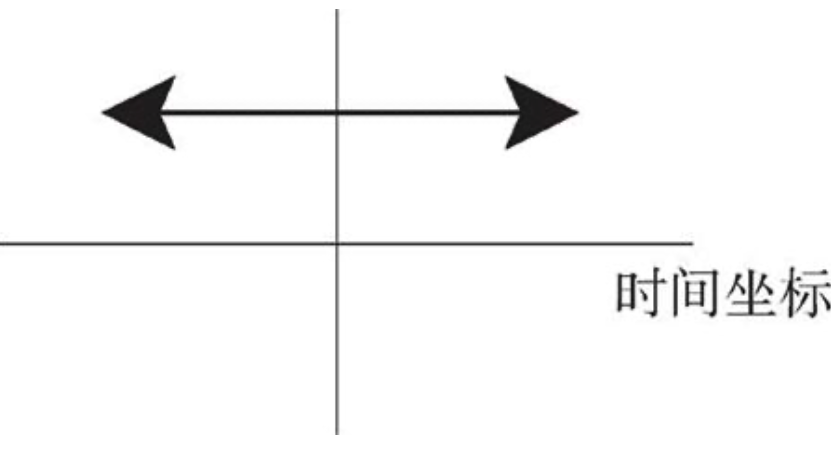
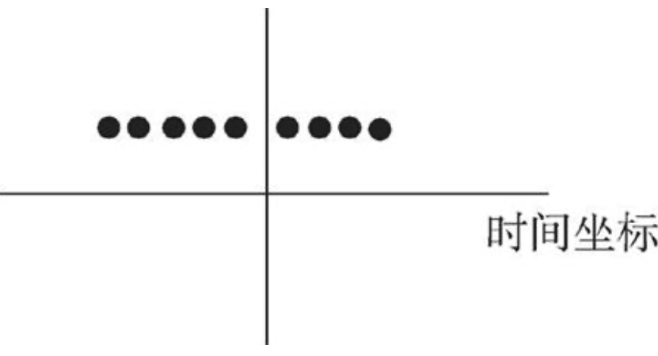
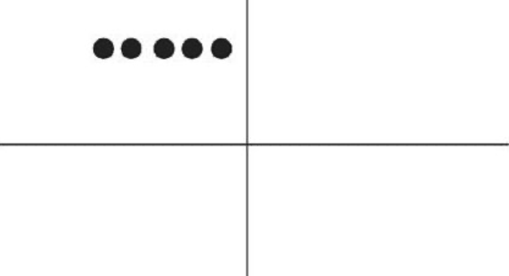
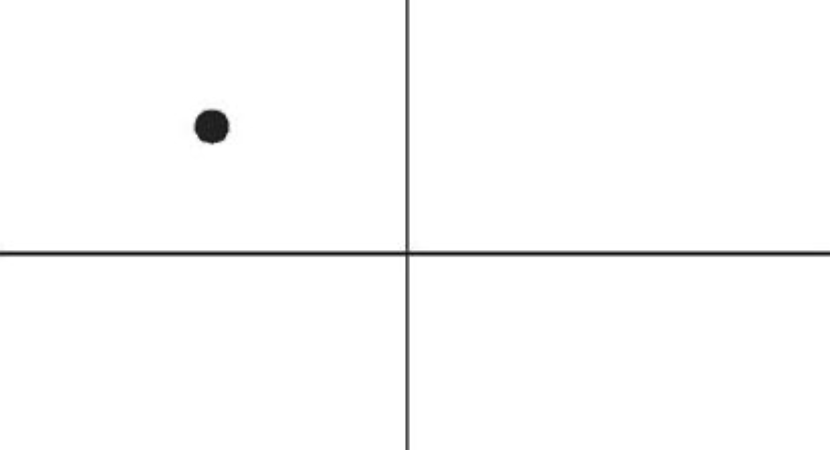
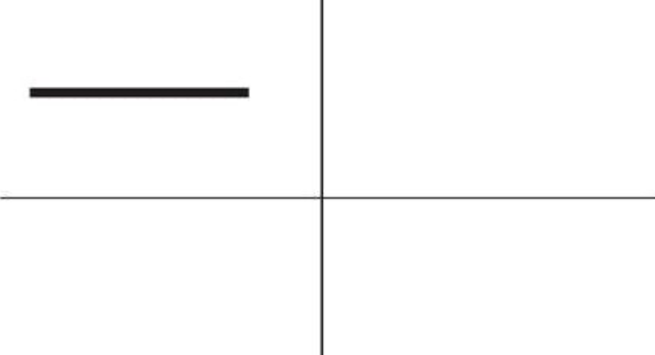
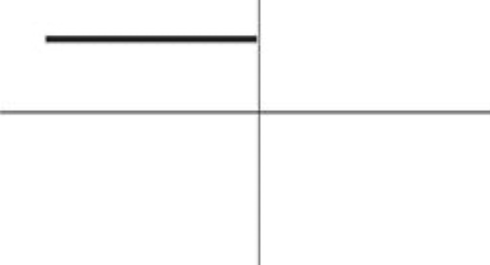

# 英文时态

## 英文时态的构成：四时四态

- tense（时）是用来规定事物发生的时间的。在英文中主要有四种不同的时间标识：  
  1．现在时（present）  
  2．过去时（past）  
  3．将来时（future）  
  4．过去将来时（past future）  
- aspect（态）是用来规定动作完成的程度，反映说话者对事物的态度的。在英文中，这种动作方面的规定有四种：  
  1．简单体（simple，或者称为“零”体态）  
  2．进行体（continuous）  
  3．完成体（perfect）  
  4．完成进行体（perfect continuous）  

|                         | 一般（Simple）                                               | 进行（Continuous）                                           | 完成（Perfect）                                              | 完成进行（Perfect Continuous）                               |
| ----------------------- | ------------------------------------------------------------ | ------------------------------------------------------------ | ------------------------------------------------------------ | ------------------------------------------------------------ |
| 现在（Present）         | 现在一般时（Present Simple） +动词原形 +动词原形 + s（第三人称单数） | 现在进行时（Present Continuous） 助动词be的变位（am/is/are） + 动词的现在分词 | 现在完成时（Present Perfect） 助动词have的变位（have/has） + 动词的过去分词 | 现在完成进行时（Present Perfect Continuous） have的变位（have/has） + been + 动词的现在分词 |
| 过去（Past）            | 过去一般时（Past Simple） +动词过去式                   | 过去进行时（Past Continuous） 助动词be的变位(was/were) + 动词的现在分词 | 过去完成时（Past Perfect） 助动词have的变位（had） + 动词的过去分词 | 过去完成进行时（Past Perfect Continuous） have的变位（had） + been + 动词的现在分词 |
| 将来（Future）          | 将来一般时（Future SImple） will（shall）+ 动词原形     | 将来进行时（Future Continuous） will + be + 动词的现在分词 | 将来完成时（Future Perfect）                                 | 将来完成进行时（Future Perfect Continuous）                  |
| 过去将来（Past Future） | 过去将来一般时（Past Future Simple）                         | 过去将来进行时（Past Future Continuous）                     | 过去将来完成时（Past Future Perfect）                        | 过去将来完成进行时（Past Future Perfect Continuous）         |

## 一般现在时

一般现在时本质的思维特征是：**表示从过去到现在直至将来的一段时间内发生的动作（action）或存在的状态（state）**。

### 用法一：表示普遍的事实或真理

表示不受时间限制的科学事实、客观真理、谚语格言，以及用于概括、结论、观点等。此时，这些动作或状态的发生不限于某个特定的时间，也即它们可发生于任何时间，包括现在、过去和将来。如下图所示：

- The sun rises in the east and sets in the west. 太阳东升西落。
- The world is round. 世界是圆的。
- The earth moves around the sun. 地球绕着太阳转。
- Knowledge is power. 知识就是力量。
- Opportunities always favor the prepared minds. 机会总是青睐有准备的人。
- Great minds think alike. 英雄所见略同。

### 用法二：表示重复活动

表示经常发生的、习惯性的动作（action）或者是存在的状态（state）。如下图所示：

#### 一、表示习惯的动作

- He often goes to the gym. 他经常去健身房。
- I go to the gym twice a week. 我每周去两次健身房。
- He walks to school every day. 他每天步行去上学。

#### 二、表示习惯的状态

- I like rice for dinner. 我晚餐喜欢吃米饭。

这一用法常和一些表示**动作频率的时间副词**连用。

1. 表示肯定的频度副词有：always，frequently，usually，sometimes，generally，occasionally和often等等。
2. 表示否定的频度副词有：never，seldom和rarely。
3. 表示频度的副词短语有：once a week，twice a year和on alternate days等等。

不过，在应用上述这些副词时，要注意以下几点：

1. 它在句子中的位置通常是：在be动词后、实义动词前。
  - He <u>is always</u> late. 他总是迟到。
  - He <u>always goes</u> to school by bike. 他总是骑自行车上学。
2. 上述否定副词不能再与否定助动词（如don't等）连用。
  - ~~He <u>doesn't seldom</u> come late~~. ❌（一般不这么说）
  - He <u>seldom comes</u> late. 他几乎从不迟到。
3. 这些副词一般放在否定助动词前，always除外。
  - His wife complains that he <u>sometimes doesn't</u> listen to her. 他的妻子抱怨，说他有时候不注意听她说话。
  - He <u>doesn't always</u> leave before 6 o'clock. Sometimes he works until 7 o'clock.

### 用法比较：表示重复活动的一般现在时态和现在完成进行时态

- I <u>swim</u> 1,000 meters every afternoon. 我现在每天下午游1,000米。
- I <u>have been swimming</u> 1,000 meters every afternoon. 到目前为止，我是每天下午游1000米。

对于例句1，何时开始swim 1000 meters 或何时将结束 swim 1000 meters，则并不是一般现在时能够表达的出来的，即**一般现在时态无法向我们展示一个明确具体的时间段**。

对于例句2，完成进行时是能够表示明确的时间段概念的，这个时间段就是“**从过去一直目前为止**”。如下图所示：

综上所述，**一般现在时是在泛泛地谈时间，并没有时间段的概念；而完成进行时表示说话人的脑子里会有一个“到目前为止”的时间段的概念，甚至是给出像for about four years这样一个明确的时间段**。通过这样的对比，相信读者朋友对一般现在时应该有了一个更深入的理解，而不会再误认为一般现在时就是表示“现在”的动作了。

### 用法三：一般现在时表示正在发生的动作

在某些特定的场合，我们可以用一般现在时表示**正在发生**的动作。具体阐述如下：

1. **一般现在时态用在以there或here开头的句子中，表示目前的短暂动作**
  - Here **comes** your wife. 你妻子来了。
  - There **goes** our bus; we'll have to wait for the next one. 我们的车开走了，我们只好等下一辆了。
2. **表示现在瞬间的动作（instant actions）**
  - 这个瞬间动作是说话人在说话的同时即刻发生的。这只适用于表达动作的动词，表示对一些动作的解说，比如：球赛解说、剧情介绍、解释自己正在做的事情、给别人一边说一边做的示范动作等等。
  - Michael **passes** to Clint. Clint to Jack, Jack back to Clint—and Clint shoots—and it's a goal! 迈克尔传给克林特，克林特传给杰克，杰克又回传给克林特一—克林特射门一一球进了！
  - The woman is a spy, now she **enters** the room, **opens** the drawer, **takes** out a pistol and slips it into her pocket. 这个女人是个间谋。现在她走进房间，打开抽屉，拿出手枪塞进衣袋里。
  - I **select** an album, **remove** the record from its cover and **put** it on the turn table. 我选了一张唱片，去掉封套，然后放在唱盘上。

### 用法四：一般现在时表示将来发生的动作

在某些特定的场合，一般现在时态有时可表示**将来发生**的动作。具体阐述如下：

1. **用在条件状语从句和时间状语从句中**
  - 主要用在条件状语从句（if和unless）和时间状语从句（when，as soon as，before 和 after 等）中，表示将来的动作。
  - Please let me know when he **comes** back. 他回来时请告诉我。
  - What are you going to do when you **leave** school? 你毕业以后想要干些什么？
  - I'll be glad if she **comes** over to visit me. 如果她来看我，我会很高兴。
  - I'll give the book to him as soon as I see him. 我一见到他就会把书给他。
  - 上述从句中的动作 come 和 see 均是将在未来发生的，但要用一般现在时表示将来。不过若从句的动作含有“**意愿**”的意思，则从句中可用will。
  - If you **will give** me a hand with these books, I'll appreciate it. 如果你愿意帮我拿这些书，我将非常感激。
  - If they **will not accept** a check, we shall have to pay in cash, though it would be much trouble for both sides. 要是他们不愿意接受支票，我们就只好用现金支付，尽管这样会给双方带来不便。
2. **在谈到未来的计划和时间安排表的时候，表示将来的动作**
  - 此时句中的动词往往是表示短暂性动作的动词，如 go，come，leave，start 和 move 等等。
  - The train starts at 2 o'clock. 火车两点钟开。
  - We move next week. 我们下周搬家。
  - They leave for Shanghai by train tomorrow evening. 他们明晚出发去上海。
3. **在从句中表示特来的动作，此时主句往往用了一个将来时**
  - I will reward the person who finds my lost kitten. 我将酬谢找到我的猫的人。
  - I will give the booklet to whoever asks for it. 谁来索取这个小册子，我就把它给谁。

### 用法五：一般现在时表示过去发生的动作

1. **表示死者的理论、著作等**
  - 因为这些理论、著作到现在仍有效；或表示一些名人名言。
  - In The Sociology of Science, now considered a classic, Robert Merton <u>discusses</u> cultural, economic, and socialforces that contributed to the development of modern science. 在《社会科学》这部经典著作里，罗伯特·默顿从文化、经济及社会等方面阐明了推动现代科学发展的力量。
  - Francis Bacon <u>says</u>, "Reading makes a full man; conference a ready man; and writing an exact man." 弗朗西斯·培根说：“读书使人充实，讨论使人机智，写作使人准确。
2. **引用书刊、报纸、通知或新近收到的信件的内容时**
  - The newspaper reads, "The criminal who killed eight women has been executed. 报纸上说：“杀害八名妇女的那个罪犯已经被处決了”
  - The sign on the washing machine says, "Out of Order. 洗衣机上有一个告示说：“洗衣机坏了。“

### 用法六：一般现在时代指现在完成时

在口语中，可以用一般现在时代指现在完成时。能这样使用的动词不多，通常有：hear，find，see，learn，tell和read等等。

- I **am** (＝have been) informed that you have been there. 有人告诉我，你到过那里。
- I **hear** (＝have heard) that he has left Beijing. 我听说他已经离开北京了。
- I **hear** (＝have heard) you're getting married. 我听说你要结婚了。
- I **hear** (＝have heard) you've been busy lately. 我听说你最近很忙。
- I **see/find** (＝have seen/found) that you have you hair cut. You look terrific! 我发现你理发了。你看上去棒极了！
- I **read** (＝have read) in the newspaper that the criminal who killed eight women has been executed.我在报纸上看到，杀害八名妇女的那个罪犯已经被处决了。

## 一般过去时

### 基本用法一：过去发生的短暂动作或状态

一般过去时常表示在过去某一个特定的时间所发生的动作或存在的状态，此时**常和表示过去的特定的时间状语连用**。这些时间状语有：yesterday，yesterday evening，last night，the night before last（前天晚上），last year，last spring（去年春天）以及three days/months/years ago等等。

> 注意，这些时间状语之前不需加介词，比如不能说：~~at last night~~，~~in last year~~或~~in three years ago~~等等。

- I **saw** him in the library **yesterday morning**. 我昨天早上在图书馆看到他了。
- I **began** to learn English **ten years ago**. 我10年以前开始学习英语。
- I **bought** this computer **three years ago**. 我三年以前买的这台电脑。
- He **was** late for school **this morning**. 他今天早上上学迟到了。
- I **was** tired **last night**, so I went to bed early. 我昨晚感到很累，所以早早地上床睡觉了。

上述例子均表示在过去某一特定的时间点（a specific point of time in the past）发生的动作或状态，可以图示为：

### 基本用法二：过去发生的重复或延续活动

表示过去的一段时间（a specific period of time in the past）内延续或重复的动作，图示为：

- I **slept** for eight hours last night. 我昨晚睡了八个小时。
- She **lived** in our town for three years, but now she is living in Beijing.她在我们这个小镇生活了三年，不过她现在住在北京。
- I **wrote** a letter once a week to my family when I was in my first college year. 在大一的时候，我通常每个星期给家里写一封信。
- He **used to do** morning exercises. 他过去常常早锻炼。

### 用法比较：一般过去时和现在完成时用于“for＋时间段”的区别

中国的英语学习者普遍存在这样一个误解：认为一般过去时态不能与“for＋时间段”连用，认为“for＋时间段”只能与现在完成时态连用。这个误解究其原因，可能是因为他们都熟悉现在完成时态可以表示一个延续的活动，常与“for＋时间段”连用，据此就错误地认为“for＋时间段”只能用于现在完成时态而不能用于一般过去时态。

一般过去时态可以与“for＋时间段”连用。比如：

1　I **slept for eight hours** last night. 我昨晚睡了八个小时。
2　She **lived** in our town **for three years**, but now she is living in Beijing. 她在我们这个小镇生活了三年，不过她现在住在北京。
3　He **worked** in that dot-com company **for one year**. Now he is studying in America. 他在那家网络公司工作过一年，现在在美国上学。

#### 区别：

现在完成时表示的延续动作图示如下：

- **一般过去时**与“for＋时间段”连用，**表示动作在过去已经结束，并没有延续到现在**。
- **现在完成时**与“for＋时间段”连用，**表示动作延续到现在，并且还有可能延续下去**。

- She **lived** in our town for three years. 她在我们小镇生活过三年（但现在不在这里）。
- She **has lived** in our town for three years. 她在我们小镇已经生活了三年 （现在还在这里）。

### 口语用法一：“我不知道”——"I don't know" or "I didn't know"?

A: Do you see the person with loose pants and long hair? Is it a boy or girl? 你看见那边穿着宽松裤子、留着长发的人了吗？是男的还是女的？  
B: A girl. She is my daughter. 是女的。她是我女儿。  
A: Oh, please forgive me. **I didn't know** you were her mother. 哦，真对不起，我不知道你是她母亲。  
B: No, I'm her father. 不，我是她父亲。

对于像这个实际的口语对话，我们很可能就把一般过去时抛到九霄云外去了。比如，上面对话中的“我不知道你是她母亲”这一句，当A说的时候其实他已经知道了，因为B已经告诉他 She is my daughter.了，也就是说，他的真正意思应该是**我刚才不知道**

**所以口语说 I didn't know**

### 口语用法二：“我忘记了”——"I forget" or "I forgot"?

语法层面，I forget 是一般现在时，I forgot 是一般过去时

口语层面，两者发生的时间不一样，比如我们说“我忘记了这个单词的意思”和“我忘记把你的随身听带来”，前者的忘记是**我现在还不知道**，后者是当我想起来之后说的一句话，**忘记已成为过去**。

- I forget the meaning of the word. 我忘了这个词的意思了
- I forgot to bring your walkman back. 我忘记把你的随身听带来

所以想表达**我忘记做某事**，英文一般都说 I forgot to do...，因为这一定是当你想起来之后才能说的一句话，“**忘记**”已成为过去，否则你不可能说出这句话。

> 此外，我忘记”还可以说成It slipped my mind...。
> - A: Did you pick up my books from Ron's house? 你是否从罗恩家把我的书捎过来了？
> - B: Sorry. **It slipped my mind**. 对不起，我忘记了。

### 口语用法三：“我以为”——"I think" or "I thought"?

- I think 我以为，相当于 I have an opinion（我这么认为），表示自己的观点。
- I thought 我以为，也可以说成是**我还以为**或者**我本来以为**，表示过去时这样认为，而现在不这么认为

- A: I really **think** that | will win the match.（我真的很肯定我会赢得这场比赛。）
- A: I really **thought** that I'd win the match. 我（本来）真的以为这个比賽我会赢的。
- B: Oh, well, better luck next time, Henry. 哦，没关系，希望你下次好运，亨利。

### 口语用法四：根据上下文的语境灵活地使用一般过去时

- Harry: Sally Alright? 哈里：是萨莉 •奥尔布赖特吗？
- Sally: Hi, Harry. 萨莉：晇，哈里。
- Harry: I **thought it was** you. 哈里：我刚才就觉得那个人像你。（因为刚才他是在远处看见萨莉的，并不敢确定那个人一定是萨莉）
- Sally: It is.Huh... this is Marie. 萨莉：就是我。呃… …这是玛丽。
- (Marie is already on her way down stairs.) （玛丽已经走到楼梯口了。）
- Sally: **Was** Marie. 萨莉：刚才在我身边的那位就是玛丽。（通过This is Marie.到Was Marie.这一时态的细微改变，充分揭示出萨莉的言外之意——“刚才在我身边的那位是玛丽”。）
- Harry: How are you? 哈里：你怎么样？
- Sally: Fine! 萨莉：很好！

再比如当两人**见面刚认识**，都会说“认识你很高兴”，用英语说成：
- It <u>is</u> nice to meet you.
但是，在两人聊天结束后，**在分手告别时**还不会忘记说上一句“认识你很高兴”，这时英语就要用过去时态了，说成：
- It <u>was</u> nice **meeting** you./It <u>was</u> nice **talking** to you.

> 注意这里用的是 nice meeting you/nice talking to you,用的是动名词 meeting 而不是不定时 to meet，习惯用语

### 口语用法五：礼貌表达

在口语中，一般过去时（也可用过去进行时）可以表示语气委婉，此时的过去时丝毫没有过去的意味，而谈的是现在的情况。

1. I **wondered** if you could help me. 我想知道你能否帮我。
2. **Could** you give me a hand? 你能帮我一下吗？
3. I **was wondering** if you could possibly lend me your car for this evening. 我想知道你今晚能否把车借给我用用。

## 一般将来时

### 引言

英语中严格上说没有**将来时态**，因为动词不会有任何变形。所以英语要表示将来时**通常**引入一个情态动词 will(shall) 来表示。

将来的事件往往是与各种情态意义联系在一起的。比如：**预测**某事将会发生，**计划**将来做某事，或表示**愿意**去做某事。因此，对于将来时态的学习，理解以下三个概念是至关重要的：

1. 预测（prediction）：表示说话人认为将来会发生某件事；
2. 事先计划（future plan）：表示说话人在头脑里已经做出决定将来要做某件事；
3. 意愿（willingness）：表示说话人既不是预计某事将会发生，也不是预先经过考虑决定将做某事，而是在说话的时刻立即做出决断表明他将去做某事。

### will表示将来——预测

will 通常被作为一般将来时态的“代言人”，其最典型的用法就是对未来进行“预测”。

下面给出的这些例句，是美国《时代》（Time）周刊在其网站上发布的，是对 21 世纪做的各种展望和预测（The Visions of the 21st Century），其中的 will 都是表示“预测”这一典型的用法。

1. 关于“科技（Science）”方面的预测包括：
  - Will we travel to the stars? （我们能够进行星际旅行吗？）
  - Will we clone a dinosaur? （我们能克隆恐龙吗？）
  - Will a killer asteroid hit the earth? （小行星能撞毁地球吗？）
  - Will the brain understand itself? （大脑能理解自己吗？）
  - Will we keep evolving? （我们人类还能一直进化吗？）
  - Will we travel back or forward in time? （我们能进入时光隧道回到过去或去到未来吗？）
  - Will we live on Mars? （我们能生活在火星上吗？）
2. 关于“人类如何生活（How We Will Live）”方面的预测包括：
  - Will women still need men? （女人还需要男人吗？）
  - What will we wear? （我们会穿什么？）
  - Will there be any teenagers? （还会有青少年吗？）
  - Will we still have privacy? （我们还能有自己的隐私吗？）
  - What will our houses look like? （我们的房子会是什么样子？）
  - Will the Internet rule our lives? （互联网能主宰我们的生活吗？）
3. 关于“我们的工作，我们的世界（Our Work, Our World）”方面的预测包括：
  - What will our offices look like? （我们的办公室会是什么样子？）
  - What will be the 10 hottest jobs? （十大热门职业会是什么？）
  - How will we fight? （我们如何作战？）
  - Will China be Number One? （中国会成为全球霸主吗？）
  - What will peace mean for the Middle East? （中东能实现和平吗？）
  - How much will the Internet rule our lives? （互联网将在何种程度上控制我们的生活？）
4. 关于“健康与环境（Health and Environment）”方面的预测包括：
  - How hot will it get? （地球将会变得多热？）
  - Will we still eat meat? （我们还需要吃肉吗？）
  - Will we keep getting fatter? （我们会一直变胖吗？）
  - Will we live to be 125? （我们能活到125岁吗？）

[The Visions of the 21st Century](https://juejin.cn/post/6844903986479251464#heading-25)

### be going to表示将来——预测

- Look at those black clouds! It's going to rain. 看这满天的乌云！要下雨了。
- It's not going to snow again tomorrow, is it? It was supposed to be warm all week. 明天不该再下雪了吧？天气预报本来还说这一周都会很暖和的。

和 will 表预测的区别：

1. **表示“预测”，be going to 比 will 有更多的证据支持，而且事件发生的时间更近**
  - 当有现在的证据可以支持预测时，或者说根据目前的明显迹象来推断某件事将要发生时，我们就要用be going to，而不宜用will。
  - With all of these typos in this resume, you <u>are not going to</u> make a very good impression. 这份简历上有这么多的打印错误，这样恐怕你不会给对方留下好印象的。
2. **表示“预测”时，will 的语气比 be going to 显得正式**
  - will比较正式，be going to更为不正式，常用于私人谈话中，所以在口语中很常用，而且be going to 在口语交流中常被读成be gonna。
  - Rachel: Okay, look, the restaurant called, they wanna know if you'<u>re gonna</u> be showing up for work. 好吧，瞧，餐馆打电话来了，他们想知道你还去不去上班。
  - Monica: Nope. Going to the Big Apple Circus today. 不去了。我今天要去纽约马戏团。
  - Rachel: Okay, Monica, what are you doing? You'<u>re gonna</u> lose your job! This is not you! 好吧，莫尼卡，你在干什么？你会丟了工作的！你可不是这样的呀！

### be going to表示“计划”与will表示“意愿”

当用be going to 表示”计划“或”打算“时，说话人在头脑里已经做出决定将来要做某件事，并且往往还含有已经为这一行动做了某些准备的意思。又因为只有人才能有主观的思维意识去对将来的行为做出“计划”，因此，be going to的这个用法主要是用于人称主语（person subject），而不可能用于非人称主语（non-person subject）。

1. **be going to 表示“计划”，需要用“人”作主语**
  - Look at those black clouds! It'<u>s going to</u> rain. 看这满天的乌云！要下兩了。 （表预测，因为不可能是老天爷”打算“下雨）
  - Close your eyes. I'<u>m going to</u> give you a surprise. 闭上眼睛，我要给你一个惊喜。（表计划打算）
2. **be going to 可以表示“决心”，具有强烈的感情色彩**
  - 当be going to的“打算”或“预测”意味进一步升华后，就可以解释成个人的“决心（great determination）”，具有强烈的感情色彩。
  - We'<u>re going to</u> become the world's leading forwarding company. 我们一定要成为世界上最大的快递公司。
3. **will 表示“意愿”，一个当机立断的决定**
  - 说话人事先并不知道，而是在得知新的信息之后，在说话的时刻立即做出决断表明他将去做某事，这是一个当机立断的决定。
  - A: The telephone is ringing. 电话铃响了。
  - B: I'<u>ll</u> get it. 我去接。
4. **比较：will表示“意愿”和be going to表示“打算”**
  - be going to 表示说话人对未来行动的计划或打算，通常是经过事先考虑并含有已经为这一行动做了某些准备的意思。
  - will 表示意愿，表示在说话的时刻立即做出决定将去做某事，事先并没有经过考虑，更没有为这一活动做出事先的准备。
  - Husband: There isn't any milk left in the fridge. 冰箱里没有牛奶了。
  - Wife: I'<u>m going to</u> buy some after work. 我打算下班后去买。
  - Wife: I'<u>ll</u> buy some after work. 我下班后去买。

> 注意
> 1. will 表”意愿“时，句子的主语通常是有生命的“人（animate agent）”
>   - The closet door <u>won't</u> open. Will you try it? 这个储藏室的门就是打不开，你要试试看吗？
> 2. will这种表示“意愿”的意义，若用于第二人称（you）的一般疑问句（Will you?）中，则可以用来提出“请求”
>   - A: <u>Will</u> you help me to mail these letters? 你能帮我把这些信件寄出去吗？
>   - B: I'll do it. 好的。
> 3. 关于will的否定
> - Paul <u>won't come</u>, because he is too busy. 我想保罗恐怕来不了，因为他太忙了。
> - Paul <u>won't come</u>, because he doesn't want to. 保罗不愿意来，因为他不想来。
> 1中 will 作为推测，2中 will 作为意愿
> 由此可知，否定形式的won't在句中会有歧义。不过，一般来讲，我们通常把won't do等同于refuse to do来理解，即表示“不愿意”，而用won't be doing来表达说话人的预测。

### 现在进行时表示将来

A: The summer holidays <u>are coming</u> soon, Jack. What are your plans? 暑假很快就要到了，杰克。你有什么计划吗？
B: Well, Mike, I <u>am taking</u> my girlfriend to Qingdao. She is a beach person, you know. 嗯，麦克，我要带我的女朋友去青岛。你知道，她喜欢海滩。

用现在进行时表示将来的动作要注意以下几点：

1. **必须带有表示将来的时间状语**
  - 用现在进行时表示将来的动作，动作发生的时间**必须指出或在前文中已经指出**，否则就可能会造成现在进行动作与一般将来动作相混淆。
2. **必须是人称主语**
  - 现在进行时表将来的这种用法，通常是表示说话人已计划安排好的活动，如果不是，则不能这样用。
  - ~~It's <u>raining</u> tomorrow.~~ ❌ 
3. **与一般现在时表示将来的区别**
  - 一、一般现在时要比现在进行时听起来更正式，个人主观色彩要淡些。
  - I <u>am leaving</u> tonight. 我想好了今晚走。
  - I <u>leave</u> tonight. 我今晚需要动身走。
  - 二、如果是一系列预定的将来的安排，比如旅游行程安排，用进行时态显得较累赘，而用一般时态则较简洁。
  - We <u>leave</u> Beijing at 9:00 tomorrow morning, <u>arrive</u> in Kunming around 12:00 and then we <u>tour</u> the World Horti-Expo Garden. 我们明天上午9点离开北京，大约12点左右抵达昆明，然后就参观世博园。
4. **用 be going to 表示计划与进行时态表示的计划区别**
  - be doing 表达的将来计划要比 be going to的计划更确定（more definite）。
  1) I'<u>m taking</u> my holiday in April. 我四月份要休假了。
  2) I'<u>m going to</u> take my holiday in April. 我打算四月份休假。

### 一般现在时表示将来

一般现在时一节

### 其他表示将来的句型结构

1. **be to do**
  - 表示已安排好要在将来发生的事，是比较正式的用法
  - They **are to go** on a strike on July 8th. 他们定于7月8日举行罢工。
  - She **is to be married** next month. 她预定在下个月结婚。
  - 表示强烈的命令，相当于must，should，如：父母对孩子、上级对下级或法律条文中的规定等
  - You **are to finish** your homework before you go to play. 出去玩之前一定要把作业完成了。
  - The form is **to be filled** out in ink and returned this week. 该表格须用钢笔填写，并于本周交回。
2. **be about to do**
  - 这一结构用来表示即将发生的动作（比如通常在5分钟之内就会发生），意思是“正要，马上就要”。
  - The train **is about to leave**. 火车马上就要开了。
  - Jack is holding a fly swatter and staring at a fly on the kitchen table. He **is about to swat** the fly.杰克手里正拿着苍蝇拍，眼睛盯着厨房桌上的一只苍蝇。他正要拍这只苍蝇。
3. **be on the point/verge/brink/eve of doing**
  - 这一结构与 be about to do 的意思差不多，但其动作发生的时间比 be about to do 还要快一些。
  - He **was on the point of killing** himself when she stepped into his room. 她走进房间时，看见他正要自杀。
  - The child **was on the verge of laughing**, but he held back. 这孩子差一点笑出声来，但还是忍住了。

## 现在进行时

现在进行时不一定正在进行

### 用法一：说话时刻正在进行的动作

现在进行时最典型的用法是**表示在说话的时刻正在进行的动作**，比如：

- Frank: Hi, Jenny. What are you doing? 嗨,珍妮。你在干什么?
- Jenny: Oh, hi, Frank. I'm doing my laundry. You? 哦，嗨，弗兰克。我正在洗衣服。你呢?

### 用法二：在目前一段时期内持续的一种暂时的情况

现在进行时还常常用来表示**现阶段正在持续的活动**。这时进行时态表示的是一个一般性的活动，在说话时刻这个动作并不一定正在发生（通常都不在发生），而是**在目前一段时期内持续的一种暂时的情况**。

- A: Have you found a position yet? 找到工作了吗？
- B: I'm still checking the papers. 我还在报纸上看招聘广告呢。
- I am not teaching English this month. I am working on a special project. 这个月我没有在教英语。我在做一个特别的项目。

### 用法三：用于表示“改变”的动词，强调“逐渐变化”的过程

常见的表示“改变”的动词有：change, come, get, become, grow 和 deteriorate（恶化）等。

- Frank: Well, this neighborhood is really booming. It's not really a suburb any more. 这附近真是越来越繁荣，已不再是郊区了。
- Jenny: Yeah, it is getting crowded. 是呀，也变得越来越拥挤了。
- It's getting dark. 天渐渐黑了下来。
- Mom is getting old. 妈妈越来越老了。
- His health is deteriorating. 他的健康状况日益恶化。
- My dream is coming true. 我的梦想正一点点地成为现实。
- I think Jenny's getting cold feet! 我认为珍妮的胆子变得越来越小了！

### 用法四：用于强烈的感情色彩的表达

在日常的**口语交际**中，我们要表达自己的各种强烈的感情，比如生气、激动和兴奋等等，我们往往会在说话的过程中频繁地使用现在进行时。此时**说话人用进行时态，并非是要强调某个正在进行的动作，而是要表达自己强烈的情感**。

- What <u>are we waiting</u> for then? Let's get started. 那我们还等什么？赶快开始吧。(不耐烦)
- I<u>'m not having</u> this conversation with you. 我不跟你说了。(生气)
- You<u>'re not asking</u> me to marry you, are you? 你该不是在向我求婚吧？(怀疑和惊讶)
- You<u>'re not backing</u> out of our date, are you? 你该不是不想和我约会吧？(怀疑和惊讶)

### 用法五：表示将来确定的安排

现在进行时在**口语**中还经常用来表示将来的动作，此时现在进行时是表示在说话之前就确定的、计划好的将来的安排。

- A: What <u>are you doing</u> on Saturday night? 周六晚上你有何安排？
- B: I<u>'m doing</u> some shopping with Jane. 我要和简去购物。
- Jenny: Yeah, it is getting crowded. Where <u>are</u> you <u>looking</u> for an apartment? 是呀，那变得越来越拥挤。你准备在哪儿找公寓呢？

> 注意与 be going to 的区别（和现在进行时都可表将来）
> - 现在进行时强调事先已经做好的安排，是比较确定要发生的。
> - be going to 着重表现说话者的计划和意图，并不是确定的安排。
> - I'<u>m staying</u> at Beijing. 我会待在北京。
> - I'<u>m going to stay</u> at Beijing. 我打算待在北京。
> 其次对于静态的动词和无生命的主语，不可能使用现在进行时来表示将来。但可以用于be going to，这时表示预测。
> - ~~The red car **is belonging to** me tomorrow.~~ ❌ 
> - The red car **is going to belong to** me tomorrow. 明天这辆红色的汽车就将属于我了。

### 用法六：与always等连用，表示多次重复，且含有感情色彩

现在进行时的感情色彩的表达，还有另外一种用法，就是常与 always, forever, continually 和 constantly 等连用，表示多次重复的行为。这种反复的行为可以是积极的、让人喜欢的事情。比如：

- Scott is very generous. He'<u>s always giving</u> his friends gifts and inviting them out for meals. 斯科特为人十分慷慨大方，他总是会送朋友礼物，并请他们吃饭。
- Although Steve is a teacher, in a sense he is a student as well. He <u>is always learning</u> things from his students. 尽管史带夫是老师，但在某种意义上，他也可以说是个学生，因为他总是愿意向他的学生学习。
- He'<u>s always pulling</u> my leg. He likes joking me. 他总是喜欢开我的玩笑。
- He'<u>s continually asking</u> me for money. 他总是向我要钱。

### 总结

1. 现在此刻正在进行的活动。
2. 现阶段在持续的活动。
3. 用于“变化”类的动词，表示现阶段逐渐变化的过程。这同用法二相近。
4. 强烈的感情色彩的表达。
5. 表示将来确定的安排。
6. 与always等连用，表示多次重复，也包含感情色彩。

## 过去进行时

过去进行时回顾过去讲故事

### 常见用法：用来设置故事的背景

在讲故事时，我们往往会用到过去进行时态was/were doing 来设置故事发生的过去背景，这是因为进行时态往往表示一个在持续的活动场景，所以用它来铺垫故事的背景，往往会给读者一种身临其境的感觉。比如  

James Bond **was driving** through town. It **was raining**. The wind was blowing hard. Nobody **was walking** in the streets. Suddenly, Bond saw the killer in a telephone box. 

詹姆斯•邦德当时正开着车，行驶在城中的街道上。窗外刮着风，下着雨，此时街上一个人也没有。突然，邦德看到那名杀手在电话亭里......

上面这种通过描写一系列过去进行的动作来渲染故事背景的过去进行时用法，多见于文学作品中。

在日常生活的叙事中，我们更多的是把“过去进行时”和“一般过去时”配合使用。此时，过去进行时通常表示一个历时较长的体现“背景”的动作或状态；而一般过去时则表示在此“背景”下发生的一个短暂的动作或状态。简言之，**长动作用过去进行时，短动作用一般过去时**，以此表示在过去进行时的动作的持续期间，发生了另一个短暂动作。这两个动作之间用when或while连接。

I **was walking** along the street late last night when suddenly **I heard** footsteps behind me. Somebody was following me. I was frightened and I started to run.

昨晚很晚我一个人走在大街上，突然我听见身后有脚步声，有人正跟着我。我当时書怕极了，就开始跑了起来（这句中的 walk 表示“一直在走”，显然是长动作，所以要用过去进行时；hear 表示“听到了”，显然是短动作）

#### 动作长短的相对性及其与时态的关系

值得注意的是，这里所说的动作的长与短是相对的。比如：

- I **was watching** TV when the telephone **rang**. 我当时正在看电视，突然电话铃响了。
- I **was walking** past the car when it **exploded**. 汽车爆炸时我正好刚走过。

总之，动作的长短是指具体句子里的两个动作的相对长短。相对短的动作用一般过去时，相对长的动作用过去进行时。若时态用错，句意可能就要发生改变。

#### when和while的区别

- when 的后面接短动作，用一般过去时，或者接长动作，用过去进行时。
- while 的后面只能接长动作，用过去进行时。

- I was walking past the car <u>when</u> it <u>exploded</u>.
- The car exploded <u>when</u> I <u>was walking</u> past it.
- The car exploded <u>while</u> I <u>was walking</u> past it.

### 少见用法：两个过去同时在持续的动作

若句中的两个动作都是较长的动作，则两个动作都用过去进行时，表示两个过去同时在持续的动作，此时分不出哪个动作先发生。

- While I **was studying** in my dorm, my roommates **were talking** loudly with their friends. 我在宿舍里学习的时候，我的室友在大声地和他的朋友说话。
- While I **was studying** last night, my wife **was watching** TV. 我昨晚学习的时候，我的妻子在看电视。

### 典型用法：描述一个过去的特定时刻正在发生的事情

- I **was discussing** my thesis with my director at this time last night. 我昨晚的这个时候正在和我的导师讨论我的论文。
- A: What were you doing at 10 o'clock last night? 昨晚10点钟时你在做什么？
- B: I was having dinner with my friends. 我在图书馆看书。

### 口语用法：表示委婉的请求或提建议

在口语表达中，我们还常常用过去进行时来表示委婉的请求或提建议，这时并不表示过去时间的动作。这尤其适用于表示态度的动词，如**wonder，hope 和 think 等**，这些动词用过去进行时（was wondering）或现在进行时（is wondering），均表示现在的一种愿望或态度，给人一种探询式的、犹豫不决的印象，因而显得很礼貌。比如：

- I **was wondering** if you'd like to lend me your car.
- I **was wondering** if you could lend me your car.
- I **was hoping** that you'd like to lend me your car.
- I **was thinking** that you'd like to lend me your car. 我希望你能把车借给我。

## 将来进行时

### 典型用法：将来某一特定时刻正在持续的事

- Don't telephone me after eight tomorrow—I'<u>ll be having</u> a meeting. 明天8点钟以后不要给我打电话，因为那时我正在开会。
- Wait until seven o'clock so that they <u>won't</u> still <u>be eating</u>. 等到7点钟再过去吧，这样他们那时就不会还在吃饭了。
- He can't play golf next Sunday because he <u>will be working</u>. 下周日他无法打高尔夫，因为那天他会正在工作。
- Do you think you <u>will</u> still <u>be working</u> here in two years' time? 你认为两年之后你还会在这里工作吗？
- By this time next year, I <u>will be writing</u> my thesis. 明年这个时候，我就会正在忙着写论文哩

### 口语用法：将来计划好的事

Professor Smith will be giving a lecture on American literature tomorrow evening. 明晚史密斯教授将会举行有关美国文学的讲座。

上面现在进行时态 be doing 也可以表示计划好的事。比如上面这个句子也可以说成：Professor Smith <u>is giving</u> a lecture on American literature tomorrow evening.

区别：
1. **现在进行时只表示最近的将来；而将来进行时既可以表示最近的将来，也可表示较远的将来**。比如：
  - I <u>am meeting</u> him tomorrow. 我明天要见他。
  - I <u>will be meeting</u> him tomorrow/next year. 我明天／明年要见他。
2. **现在进行时表示最近将来的动作时，必须有确定的表示将来的时间状语；而将来进行时则没有这种限制**。请比较：
  - He'<u>s working</u> in this room next <u>Monday</u>. 他下周一将在这个房间里工作。
  - He'<u>ll be working</u> in this room. 他将在这个房间里工作。

### 少见用法：表示背景动作一一提供另外一个短动作发生的事件背景

同过去进行时的用法类似，将来进行时可以表示一个背景动作，来描述在这个背景动作下，将会发生的另外一个短暂动作。

- They probably **will be watching** TV when we get there. 等我们一会儿到那时，他们可能正在看电视。
- **Will** your friends **be waiting** for you at the airport when you arrive? 你一会到达机场时，你的朋友们会在那接你吗？

### 难点用法1：用在疑问句中，表示客气地询问

比如商店购买物品，营业员会说：How will you be paying for this? 而不是 How will you pay for this?

这是将来进行时态的一种很有用的用法，即我们**用它来“礼貌地询问”，显得比一般将来时 will do 更委婉客气**。

- will be doing 常表示很客观地询问事实，并不想干涉对方的决定
- will do 往往带有各种感情色彩，如请求、命令、指示、质问甚或威胁等等

**如果我们是要客观地询问事实，宜用 will be doing 来提问；而若是其他语气，比如请求或命令等，我们则要用 will do 来提问**。我们再看下面这对句子：

- **Will** you **be staying** in this evening? 今晚你不出去吧？
- **Will** you **stay** in this evening? 今晚你不要再出门了行不行？！

### 难点用法2：用来表示客观的将来，以避免与表示“意愿”的will do混淆

- will be doing表示客观的将来（来不了 won't be coming）
- will do表示主观意愿。（不愿来 won't come）

A: It's already 10 o'clock. I guess Bob and Amy **won't be coming** to the party. 现在已经10点了，我猜鲍勒和埃米不会來参加聚会了。
B: They called at nine to say that they'd been held up. 他们9点钟时打过电话，说有事耽误了。

说话人用won't be coming是想强调鲍勃和艾米可能是因为其他事情耽误了而“来不了”这一客观事实，而不是主观意愿上的“不愿来”。下文紧接着就说明了他们来不了的原因是they had been held up（他们有事耽误了）。如果说：Bob and Amy won't come to the party. 因为won't do的意思往往相当于refuse to do，表示“拒绝做，不愿意做”。所以，对于这句话人们一般会理解为“鲍勃和艾米不愿意来参加聚会”。而在原文中，说话人其实是在强调客观将来的时间——“来不了”，而不是“不愿来”。所以，我们看到，这里一个won't be coming，一个won't come，两者的意思大相径庭。

### 总结

将来进行时态 will be doing 可能有下列五种意义和用法：
1. 想象自己或其他人在将来某一特定的时刻正在做某事。
2. 表示计划好的事。
3. 表示背景动作。提供另外一个短动作发生的事件背景。
4. 用在疑问句中，表示客气的询问。这一用法在口语中尤为常见。
5. 用will be doing来表示客观的将来，以避免与表示“意愿”的will do混淆。

<SideTitle :page="$page" />
