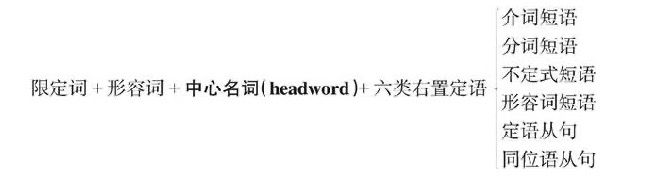

# 名词

## 名词短语

语言的构造级别可以分为这样五个层次：

1. 词（word）
2. 短语（phrase）
3. 句子（sentence）
4. 段落（paragraph）
5. 篇章（discourse）

### 功能
“简单句的主语（如例句1）、宾语（如例句2、3、4）或表语（如例句5）通常由名词短语来充当”

- 简单句主语 **These red roses** are for you
- 宾语 I have **three close friends**
- 表语 He is **my best friend**
- 介词的宾语 There are some red roses on **that small table** （介词不能单独使用，其后面必须接宾语，所接的并于也往往是名词短语）

### 构造-左二右六

名词短语是由名词与它的修饰语一起构成的。名词的修饰语与名词的位置关系不外乎两种：

- 放在被修饰名词的前面 => 前置定语或定语
  1. 限定词 these, three, a, the, my和that
  2. 形容词 red, close, new, best和small
- 放在被修饰名词的后面 => 后置定语
  1. 后置修饰语的种类很多，包括定语从句、同位语从句、分词短语、不定式、介词短语、形容词短语和副词短语等等

综上所述，在英语里，修饰名词的定语，其语序的位置是极有规律的，可以总结为下列的`黄金公式`：

`尽管可以有副词作右置定语，但因较少用到，在此不作讨论`

### 英语句子的五成分论

主语、谓语、宾语、补语和状语这五种**句子成分**都是在**句子**这一层级上的成分

定语成分则**稍逊一层**，它属于**短语**这一层级，是属于**短语成分**，即是组成名词短语的成分，然后通过名词短语间接地构成句子成分

## 名词的定义与分类

### 定义

名词是用来表示人、事物、地点以及抽象事物的名称的（A noun is the name of a person or thing）比如：
- 人：John, sister, father
- 事物：water, air, sun, computer
- 地点：London, theater
- 抽象事物：love, happiness, imagination, hope

### 分类

<table>
  <tr>
    <td colspan="3"></td>
    <td>意义</td>
    <td>例句</td>
  </tr>
  <tr>
    <td colspan="3">专有名词</td>
    <td>表示特定的人、物、机构或场所的名词(首字母须大写)</td>
    <td>Paris, the United States, Bill Gates</td>
  </tr>
  <tr>
    <td rowspan="4">普通名词</td>
    <td rowspan="2">可数名词</td>
    <td>个体名词</td>
    <td>表示同类的人或物中的个体</td>
    <td>student、tree、hospital、house、piano</td>
  </tr>
  <tr>
    <td>集体名词</td>
    <td>表示若干人或物的总称</td>
    <td>team、committee、police、group、family</td>
  </tr>
  <tr>
    <td rowspan="2">不可数名词</td>
    <td>物质名词</td>
    <td>表示物质和材料的总称</td>
    <td>paper、water、cotton、air</td>
  </tr>
  <tr>
    <td>抽象名词</td>
    <td>表示动作、性质、状态或情感等抽象概念的名称</td>
    <td>birth、happiness、evolution、technology、management、imagination、hope、sport</td>
  </tr>
</table>

#### 专有名词

- 人名及头衔——Winston Churchill, the Queen of England, the President of the United States, Doctor Mathews, Professor Samuels 等
- 著作名称——War and Peace（《战争与和平》）、The Merchant of Venice（《威尼斯商人》）、Pride and Prejudice（《傲慢与偏见》）
- 月份——一年中12个月份的名称：January, February, March, April, May, June, July, August, September, October, November, December
- 星期、四季 
  1. 一周七天是：Sunday, Monday, Tuesday, Wednesday, Thursday, Friday, Saturday
  2. 一年四季是：winter, summer, spring, autumn
- 节日——Christmas, Easter, New Year's Day, Mother's Day, Thanksgiving Day 等
- 地理名称
  1. 国家及大洲的名称：America, Africa, Europe, Asia, England, Scotland, China, Peru, Albania 等
  2. 地区、城市的名称：Rome, Vancouver, Beijing, Florence, California, Florida 等
  3. 江、河、湖泊的名称：the Atlantic, the Dead Sea, the Pacific, Lake Victoria, Lake Michigan, the Rhine, the Thames, the Nile 等
  4. 山脉、沙漠的名称：the Himalayas, the Alps, the Sahara 等

#### 普通名词

见上表格

#### 简单名词和复合名词

- 简单名词就是组成部分不可被分割的名词，比如story, student和teacher等。英语中的名词绝大多数是简单名词
- 复合名词就是由若干单词组合而构成的名词，比如girlfriend, roommate和mother-in-law（岳母／婆婆）等等

## 名词的数-可数与不可数

对于英语中名词的`数（number）`的概念，我们将主要从两个角度来讨论：

1. 名词的可数性，即区分可数名词（countable noun，在词典中标注为［C］），这一角度侧重于名词的**意义**方面而不是**构成形式**方面
2. 名词的单数与复数形式，这一角度侧重于名词的**构成形式**方面

所以，这两个角度分别是从意义（meaning）与形式（form）两个方面来讨论名词

### 常用不可数名词

1. 无法分割的名词
  - 气体：air, fog, oxygen, smoke 等
  - 液体：beer, blood, coffee, cream, gasoline, honey, juice, milk, oil, tea, water, wine 等
  - 固体：bread, butter, cheese, ice, ice cream, meat, beef（牛肉）, chicken（鸡肉）, fish（鱼肉）, chalk, copper, cotton, glass, gold, iron, paper 等
2. 一些因其组成部分太小而不易数的名词
  - corn、grass、hair、rice、sand、snow、sugar、salt
3. 表示总称的名词通常不可数
  - clothing、food、furniture、fruit、makeup、jewelry、money、cash、character、poetry、luggage、homework、housework
4. 抽象的名词一般是不可数的
  - advice、art、beauty、love、life、time、music、help、energy、knowledge、experience、nature
5. 表示研究学科
  - biology、chemistry、history、math、grammar、geometry

### 可数与不可数的相对论

名词的可数性重在**意义**而不是形式，与使用的**语境**有关，意义和语境的不同会导致名词的可数性不同，这就是名词可数性的`相对论`

规律：

1. 对于物质名词或总称的名词，若是表示不同的种类，或者因为特定的意思，或者是液体表示“几杯”或“几瓶”这样的数量，则转化为可数名词
  -  I like **cake**, not hamburger
  -  My mother is making **a cake** in the kitchen
2. 对于抽象名词，若是具体化了，则转化为可数名词
  - 比如art（艺术）／an art（一项技术，一门特定的艺术）；beauty（美丽）／a beauty（一个美人）；youth（青春）／a youth（一个年轻人）
  - She had great **beauty** in her youth
  - She was **a beauty** in her youth
3. 表示抽象的、总称的概念一般做不可数。表示具体的、特定的事物一般做可数
  - The square covers **an area** of 20,000 square meters
  - Shanghai is the largest city in **area** in China, but Beijing is the largest city in population

### 不可数名词的度量

#### 不可数名词与量词

1. 常用piece修饰以下抽象名词和物质名词
  - 比如：advice, bread, baggage, chalk, equipment, furniture, information, jewelry, luggage, music 和 news 等
  - a piece of news（一条消息）
  - two pieces of news（两条消息）
  - several pieces of furniture（几件家具）

2. 用bottle, cup, drop和glass修饰液态物质
  - 比如：beer, blood, coffee, milk, tea, water 和wine 等
  - several drops of blood（几滴血）
  - a glass of milk（一杯牛奶）
  - two glasses of wine（两杯葡萄酒）
  - two cups of coffee（两杯咖啡）

3. 其他的两次
  - a loaf of bread (一片面包)
  - a tube of toothpaste（一桶牙膏）
  - a slice of meat（一片肉）

#### 不可数名词不能被 a(an) 修饰

#### 不可数名词不能被基数词修饰

## 名词的数-单数与复数

名词的单复数也就是名词部分的`构成形式`方面

- 单数（singular）sg
- 复数（plural）pl

### 只用作单数名词

- 不可数名词
- 专有名词

### 只用作复数名词

#### "二合一"的复数名词

1. 工具和仪器
  - glasses（眼镜）
  - spectacles（眼镜）
  - binocular（双筒望远镜，双目显微镜）
  - scales（天平）
  - clippers（理发剪，指甲刀）
  - forceps（钳子，镊子〈尤指外科医生用的镊子〉）
  - pincers（铁钳，钳子〈比如家用的老虎钳〉）
  - tongs（钳子，夹子，镊子〈比如火钳子〉）
  - tweezers（小钳〈比如女用的夹眉毛的小钳子〉）
  - scissors（剪刀）
  - shears（大剪刀）

2. 服装 
  - jeans（牛仔裤）
  - trousers（长裤）
  - shorts（短裤）
  - trunks（男士泳裤）
  - briefs（内裤）
  - pants（短裤）
  - slacks（休闲裤）
  - pajamas（睡衣）

#### "单行复义"的名词

- people （person 相当于是 people 的单数形式）
- cattle 
- police
- poultry
- livestock

#### "the+形容词"——表示一类人的复数名词

ep: **The rich** are becoming richer

####  复数专有名词

- the Alps 阿尔卑斯山脉
- The Himalayas are the roof of the world. 喜马拉雅山脉是世界屋脊。
- The Great Lakes are a series of five lakes between the USA and Canada. 五大湖是位于美国和加拿大之间的五个湖。
- The Niagara Falls are the falls on the Niagara River. 尼亚加拉瀑布是位于尼亚加拉河上的一个瀑布群。

### 规则的复数名词

1. **一般在词尾加-s**
  - 比如：desk/desks, book/books, hand/hands, dog/dogs, bee/bees, face/faces, orange/oranges等
2. **以-s, -x, -ch, -sh结尾的名词加-es**
  - 比如：class/classes, box/boxes, match/matches, bush/bushes等
  - 特别注意：以-ch结尾的名词，若-ch发/k/音，则加-s，例如：stomach/stomachs
3. **以“辅音字母＋y”结尾的名词，变-y为-i，再加-es；而以“元音字母＋y”结尾的名词，则加-s**
  - 比如：country/countries, family/families, baby/babies, lady/ladies
  - play/plays, boy/boys, guy/guys, donkey/donkeys, monkey/monkeys, key/keys等
4. **有关以-o结尾的名词**
  - 一般加-es的名词有：tomato/tomatoes（西红柿）hero/heroes（英雄）Negro/Negroes（黑人）veto/vetoes（否决）这些一般是以“辅音字母＋-o”结尾的名词
  - 一般（辅音字母-o结尾）加-s的名词有：dynamo/dynamos（发电机）kilo/kilos（千克）kimono/kimonos（和服）memo/memos（备忘录）piano/pianos（钢琴）photo/photos（照片）soprano/sopranos（女高音歌手）solo/solos（独奏曲）tobacco/tobaccos（烟叶）
  - 一般（元音字母-o结尾）加-s的名词有：bamboo/bamboos（竹子）cuckoo/cuckoos（布谷鸟，杜鹃鸟）radio/radios（收音机）studio/studios（工作室，演播室）zoo/zoos（动物园）
  - 少数名词后加-s或加-es均可：memento/memento(e)s（纪念品）motto/motto(e)s（座右铭）volcano/volcano(e)s（火山）manifesto/manifesto(e)s（宣言）
5. **有关以-f或-fe结尾的名词**
  - 一般变f, fe为v，再加-es的词有下面12个：calf/calves（小牛）half/halves（一半）knife/knives（小刀）leaf/leaves（树叶）life/lives（生命）loaf/loaves（一条，一只）self/selves（自身）sheaf/sheaves（一捆，一束）shelf/shelves（架子）thief/thieves（贼）wife/wives（妻子）wolf/wolves（狼）
  - 一般直接加-s的名词有：belief/beliefs（信仰）chief/chiefs（首领）cliff/cliffs（悬崖）proof/proofs（证据）reef/reefs（暗礁）roof/roofs（屋顶）safe/safes（保险箱）
  - 少数名词后加-s或变f, fe为v加-es均可：dwarf/dwarfs/dwarves（矮人）handkerchief/handkerchiefs/handkerchieves（手帕）hoof/hoofs/hooves（蹄）scarf/scarfs/scarves（围巾）wharf/wharfs/wharves（码头）

### 不规则的复数名词

1. **以-a结尾的拉丁语名词，词尾变为-ae或-as（少数词）**
  - alga/algae（海藻）alumna/alumnae（女校友／女毕业生）antenna/antennae/antennas（天线）formula/formulae/formulas（公式）larva/larvae/larvas（幼虫）
2. **以-ex或-ix结尾的拉丁语名词，在词尾直接加-es，或把-ex和-ix变为-ices**
  - apex/apexes/apices（顶点，最高点）appendix/appendixes/appendices（附录，阑尾）index/indexes/indices（索引）
3. **以-is结尾的希腊语名词，变-is为-es**
  - analysis/analyses（分析）basis/bases（基础）crisis/crises（危机）diagnosis/diagnoses（诊断）thesis/theses（论文）
4. **以-on或-um结尾的名词，变-on或-um为-a，有的可在词尾直接加-s**
  - bacterium/bacteria（细菌）criterion/criteria/criterions（标准）datum/data（数据）erratum/errata（错误，错字勘误表）medium/media/mediums（媒介，介质）memorandum/memoranda/memorandums（备忘录）phenomenon/phenomena（现象）
5. **变-oo-为-ee-**
  - foot/feet（脚）tooth/teeth（牙齿）goose/geese（鹅）
6. **变-ouse为-ice**
  - mouse/mice（老鼠）louse/lice（虱子）
7. **以-us结尾的拉丁语名词，变-us为-i，有的可在词尾直接加-es**
  - alumnus/alumni（男校友）bacillus/bacilli（杆菌）cactus/cacti/cactuses（仙人掌）fungus/fungi/funguses（真菌）genius/genii/geniuses（天才）nucleus/nuclei/nucleuses（原子核）stimulus/stimuli（刺激物）

### 复合名词变复数

1. **“man/woman＋名词”构成的复合名词**
  - 由“man/woman＋名词”构成的复合名词，两个词均须变为复数。例如：
  - man teacher/men teachers（男老师）
  - man doctor/men doctors（男医生）
  - man servant/men servants（男仆）
  - woman pilot/women pilots（女飞行员）
  - woman journalist/women journalists（女记者）

2. **以-man/-woman/-child结尾的复合名词**
  - 以-man/-woman/-child结尾的复合名词变复数时，将-man/-woman/-child变为复数。例如：
  - fireman/firemen（消防员）
  - chairwoman/chairwomen（女主席）
  - horseman/horsemen（骑兵）
  - grandchild/grandchildren（孙子／女）
  - policeman/policemen（警察）
  - Englishman/Englishmen（英国人）
  - Frenchman/Frenchmen（法国人）
  - 但是German不是一个合成词，所以其复数形式是在词尾直接加-s，即Germans

3. **“名词＋介词或介词短语”构成的复合名词**
  - 名词＋介词或介词短语”构成的复合名词变复数时，将主体名词（或者说中心名词）变为复数。例如：
  - comrade-in-arms/comrades-in-arms（战友）
  - 注意：不是comrades-in-arm 这里的arms要用复数形式
  - passer-by/passers-by（过路人）
  - runner-up/runners-up（亚军）
  - looker-on/lookers-on（旁观者）
  - mother-in-law/mothers-in-law（岳母／婆婆）
  - editor-in-chief/editors-in-chief（总编辑）
  - bride-to-be/brides-to-be（即将成为新娘的人，准新娘）

4. **由短语动词演变成的复合名词**
  - 由动词短语演变成的复合名词，一般没有主体名词，变复数时在词尾加-s。例如：
  - forget-me-not/forget-me-nots（勿忘我）
  - go-between/go-betweens（中间人）
  - grown-up/grown-ups（成年人）
  - take-off/take-offs（起飞）
  - assistant director/assistant directors（助理导演）
  - babysitter/babysitters（保姆）
  - breakdown/breakdowns（崩溃，衰落）
  - close-up/close-ups（特写镜头）
  - grown-up/grown-ups（成年人）
  - takeover/takeovers（接管）
  - sit-in/sit-ins（静坐抗议）
  - stand-by/stand-bys（可以信任的人）

5. **“名词＋形容词”构成的复合名词**
  - 名词＋形容词”构成的复合名词变复数时，变名词为复数。例如：
  - notary public/notaries public（公证员）
  - secretary general/secretaries general（秘书长）
  - Attorney General/Attorneys General（［美］司法部长，大法官／［英］总检察长）
  - consul general/consuls general（总领事）

### 单复数同行的名词（零复数名词）

#### 动物名称

1. **永远用作零复数**
  - sheep（绵羊）从来没有sheeps这个词形
  - deer（鹿）从来没有deers这个词形
2. **通常用作零复数**
  - bison（北美野牛）a bison/two bison
  - grouse（松鸡）a grouse/two grouse
  - quail（鹌鹑）a quail/two quail
  - salmon（三文鱼，大马哈鱼）a salmon/two salmon
3. **零复数和规则复数均可**
  - antelope（羚羊）复数可以是antelope，或者是antelopes。
  - reindeer（驯鹿）复数可以是reindeer，或者是reindeers。圣诞节前夜，圣诞老人骑的就是这种鹿。
  - fish（鱼）复数可以是fish，或者是fishes。
  - flounder（比目鱼）复数可以是flounder，或者是flounders。

#### 国际名称
以-ese结尾的国籍名词常用零复数。常见的这类名词有：
Chinese（中国人）这是每个中国的英语学习者都应该知道的。“一个中国人”是one Chinese，“13亿中国人”是1.3 billion Chinese。这里的复数还是用Chinese，而不是Chineses*。
其他的词还有：
- Japanese（日本人）one Japanese/ten Japanese
- Lebanese（黎巴嫩人）one Lebanese/ten Lebanese
- Portuguese（葡萄牙人）one Portuguese/ten Portuguese
- Vietnamese（越南人）one Vietnamese/ten Vietnamese

::: tip 注意
这类名词不同于不变形的不可数名词（如music），不可数名词是永远用作单数的，没有复数。这类名词也不同于不变形的复数可数名词（如people），复数可数名词是永远用作复数的，没有单数。而我们这里讨论的单复数同形的名词（如sheep），是既可以用作单数，也可以用作复数的，只是没有形式的变化。  
因此，没有形式变化的名词有三类：  
第一类是不可数名词，如music，它们没有词形的变化，只能用作单数。  
第二类是复数可数名词，如people，它们没有词形的变化，只能用作复数。  
第三类是单复数同形的名词，如sheep，它们没有词形的变化，但既可以用作单数，也可以用作复数。  
请读者注意区分这三类名词，大家不妨记住这里的三个名词：music, people和sheep，通过这三个例子来帮助我们记住它们背后的用法规则。  
:::

### 有新词义的复数名词

在英文中，有些名词在变成复数的时候，词义会有所变化；或者说当这些名词用于某个特定的意思时，通常用其复数形式

- arm（手臂）/ arms（＝weapons 武器，军事）
- custom（风俗）/ customs（海关）
- damage（损坏，损失）/ damages（赔偿金）
- letter（信）/ letters（文学）
- minute（分钟）/ minutes（会议记录）
- security（安全）/ securities（证券）
- line（行）/ lines（台词）等

名词
- 意义 => 可数、不可数
- 构成形式 => 单数、复数

## 名词的格

### 's所有格的构成

名词所有格“'s”主要用来表示有生命的名词的所属关系。所以它通常用在姓名、人称、不定代词、集体名词和高等动物等这样的名词后面。
比如：
- 姓名（names）：Mary's brother, Jones's car
- 人称（personal nouns）：my brother's car, the lawyer's office, children's reading, women's wear
- 不定代词（indefinite pronouns）：nobody's fault, everyone's responsibility
- 集体名词（collective nouns）：the party's decision, the committee's decision, the company's accounts
- 高等动物（animals）：the horse's mouth, the horse's stable（马棚）, a bird's nest（鸟窝）

### 名词后添加s规则

####  一、单数名词

单数名词的所有格，在词尾加“'s”。比如：

1. my sister's boyfriend 我姐姐的男朋友
2. the people's choice 人民的选择
3. a woman's intuition 女人的直觉

#### 二、复数名词

对于复数名词的所有格的构成，要分下面两种情况：

1. 不以-s或-es结尾的特殊变化的复数名词，在词尾加“'s”。比如：
  - the Children's Day 儿童节
  - the children's books 儿童读物
  - women's wear 女装
  - Tom and John are men's names. “汤姆”和“约翰”都是男子名。
2. 以-s结尾的复数名词，在词尾加“'”构成所有格。比如：
  - her friends' money 她朋友的钱
  - The stars' concert was a sell-out. 这些明星们的音乐会门票已售完。

#### 三、复合名词

复合名词的所有格，在最后一个词的词尾加“'s”构成。比如：

- my father-in-law's company 我岳父的公司
- everyone else's viewpoints 其他人的看法
- Henry the Eighth's wives 亨利八世的妻子们

#### 四、并列名词

对于由and连接的并列名词，当表示“共有”的情况下，只需在最后一个名词的词尾加“'s”；若表示“各自所有”，则须在每个名词的词尾加“'s”。比如：

- John and his wife's bank savings 约翰和他妻子的共有存款
- John's and his wife's bank savings 约翰和他妻子各自的存款

### ’s所有格的逻辑语义关系

#### 一、所属关系

所谓“所属关系”，就是指某人所拥有的人或物。在以上讨论的例子中，“'s”主要是用来表示所属关系。比如：

- my father-in-law's company 我岳父的公司
- my sister's boyfriend 我姐姐的男朋友

#### 二、主谓关系

How will Bhutto's death affect the world?（布托之死将会如何影响世界？）

名词短语Bhutto's death相当于说Bhutto died，表示“布托死了，即相当于一个主谓关系

由上面这个例子可知，所谓“主谓关系”，是指所有格名词（如Bhutto）相当于主语，而被修饰的名词（如death）相当于一个谓语。此时，这个被修饰的名词通常都是由一个动词转化过来的，比如death对应的动词die

#### 三、动宾关系

Bhutto's assassination rocks Pakistan（布托的刺杀事件震动了整个巴基斯坦）

名词短语Bhutto's assassination相当于说assassinate Bhutto，表示“刺杀布托”，即相当于一个动宾关系。显然，这里的Bhutto's assassination不是上面所说的主谓关系，即不是表示“布托刺杀别人

由上面的例子可知，所谓“动宾关系”，是指被修饰的名词（如assassination）相当于一个谓语，且是及物动词（如assassinate）。而所有格名词（如Bhutto）相当于这个及物动词的宾语。此时，这个被修饰的名词通常都是由一个动词转化过来的，比如assassination是由动词assassinate转化而来

#### 四、同位关系

For Washington, Bhutto's loss is incalculable.（对于华盛顿（即指美国）来说，失去了布托这一损失无法估量）

这里的名词短语Bhutto's loss相当于说the loss of Bhutto，表示“失去了布托这一损失”或“损失了布托”。这里loss是中心词，表示“损失”，而Bhutto's是用来详述具体损失了什么东西，补充说明loss，即相当于一个同位语。显然，这里的Bhutto's loss既不是上面所说的主谓关系来表示“布托失去了（什么东西）”，也不是动宾关系来表示“某人弄丢了布托”

以上讨论的例子都是关于名词所有格“'s”适用于有生命的名词。名词所有格还可以用于以下“非生命名词”，此时一般都不是表示所属关系。具体的逻辑关系如下：

#### 五、表示时间或距离

所有格“'s”用在表示时间的名词后面。比如：
- today's newspaper 今天的报纸
- tomorrow's weather 明天的天气
- tonight's TV 今晚的电视节目
- last night's storm 昨夜的暴风雨
- a hard day's work 一整天的辛勤劳动
- a week's holiday 一周的假期
- a month's salary 一个月的薪水
- three hours' delay 三小时的耽搁
- I am very tired after a hard day's work. 苦工作了一天之后，我感到非常疲惫
- My birthday is in two weeks' time. 我的生日是在两周之后
- Let's have ten minutes' break. 我们休息10分钟吧
- My college is fifteen minutes' ride from my home. 我的大学离我家开车15分钟

#### 六、表示重量或价值等度量

- two pounds' weight 两磅重
- a ton's weight 一吨重
- a ton's steel 一吨钢材
- two dollars' worth of sugar 两块钱的白糖
- ten dollars' worth of meat 10块钱的肉

#### 七、表示国家、城市、国际组织或地理名词等

- China's population 中国的人口
- China's industrial development 中国的工业发展
- China's exports and imports in January 中国1月份的进出口额
- America's West Coast 美国的西海岸
- Jinmao Tower, Shanghai's tallest building 金茂大厦，上海的第一高楼
- the city's weather 这个城市的天气
- the European Union's exports 欧盟的出口额
- the world's three most famous tenors 世界最著名的三大男高音
- the world's seven wonders 世界七大奇迹
- the earth's surface 地球的表面

#### 八、用于交通工具及其部件的所属关系

- the car's exhaust 汽车的排气管
- the plane's engine 飞机的发动机
- the yacht's mast 游艇的桅杆
- the ship's boiler 轮船上的锅炉

### 名词所有格修饰的名词被省去

#### 一、避免名词重复

具体来说，若名词所有格所修饰的名词已经出现过，则在第二次出现的所有格后面的名词可以省去，以避免重复。请看例句：

- This bike is mine, not Michael's (＝Michael's bike). 这辆自行车是我的，不是迈克尔的。
- This is my room and that is my sister's (＝my sister's room). 这是我的房间，那是我姐姐的房间。
- I don't know her name, but I can tell you her husband's (＝her husband's name). 我不知道她的名字，但是我可以告诉你她丈夫的名字。

#### 二、表示店铺或教堂

具体来说，在一些表示店铺或教堂的名词的所有格后面可省去名词，此时所有格表示相应的场所，且一般要在所有格名词前加定冠词the。例如：

- at the baker's (＝baker's shop) 在面包店
- at the butcher's (＝butcher's shop) 在肉铺
- at the chemist's (＝chemist's store) 在药店
- at the florist's (＝florist's shop) 在花店

#### 三、表示某人的住宅

具体来说，在人名后的所有格省去名词时，表示某人的住宅。比如：

- go to my sister's (＝my sister's home) 去我姐姐家
- I called at my uncle's yesterday (＝my uncle's home). 我昨天拜访了我叔叔家。

## 名词的格-of属格的构成及逻辑语义关系

### of属格的构成

其基本构成是：N1＋of＋N2。这里N1表示第一个名词，N2表示第二个名词。一般来说，of属格主要用于以下两种情形

1. 表示无生命物体的名词的所有关系
  - the roof of the church 教堂的屋顶
  - the name of the song 歌曲的名字
  - the title of the book 书名

2. 当有生命的名词后面接短语或从句修饰时，也用of属格
  - What is the name of **the boy sitting next to her**?（坐在她身边的那个男孩叫什么名字？）
  - 这里的boy被分词短语sitting next to her所修饰，此时要表示“这个男孩的名字”就不能用's所有格，说成What is the boy sitting next to her's name?而是要借助of属格来表达。如果没有这个分词短语修饰boy，我们则可以直接用's所有格这么说：What is the boy's name?
  - The mother of **the boy in a red suit** is president of our company.（穿红色西服的那个男孩的妈妈是我们公司的总经理。）
  - 这里同样不能用's所有格说成The boy in a red suit's mother is president of our company. 如果没有介词短语in a red suit修饰boy，则可以直接说the boy's mother。

### of属格的逻辑语义关系

of 最熟悉的应该是它表示的“所有关系”，译成 **……的**

除此以外，of 还可以表示其他语义关系，常见的三种 of 的语义关系：主谓关系、动宾关系和同位关系

#### 主谓关系：从右往左翻译

基本结构是N1＋of＋N2，这里N1是由**不及物动词**变化过来的名词，表示某个行为，这一行为是由N2来发出的。或者说，N2是N1行为的执行者。比如：

- the arrival of my mother 我妈妈到了（这里第一个名词arrival是由不及物动词arrive变化过来的，它表示一个行为；而第二个名词my mother则是这个行为的执行者，即相当于说my mother arrived）
- the emergence of a strong center party 一个强大的中间党派的出现
- the rise of the U. S. Superpower 超级大国美国的兴起

#### 二、动宾关系：从左往右翻译

其基本结构是N1＋of＋N2，这里N1是由**及物动词**变化过来的名词，与上述“主谓关系”相反，N2是N1行为的承受者，而不是执行者。比如：

- America's invasion of Iraq 美国入侵伊拉克
- William's conquest of England 威廉王征服英国
- a statement of the facts 陈述事实
- the discussion of the plan 讨论这个计划

#### 三、同位关系

其结构是N1＋of＋N2，这里N2表示N1的具体内容，二者互为同位说明。比如：

- the city of Rome 罗马城市 （相当于Rome is a city或者说The city that I mean is Rome. 这与the people of Rome中的of表达的逻辑关系显然是不同的）
- the news of the team's victory 该队胜利的消息
- the news of the team's having won 该队获胜的消息（意思是the news that the team had won或The news was that the team had won.）

<SideTitle :page="$page" />
