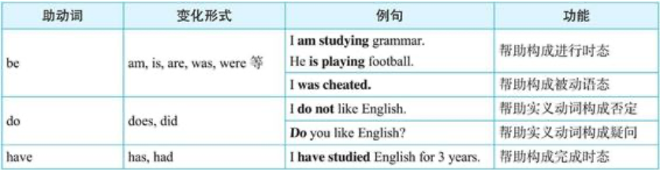
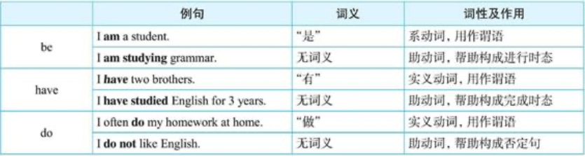
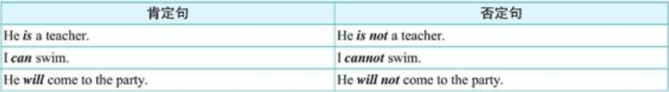
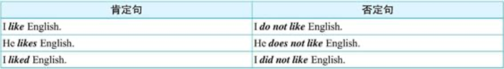
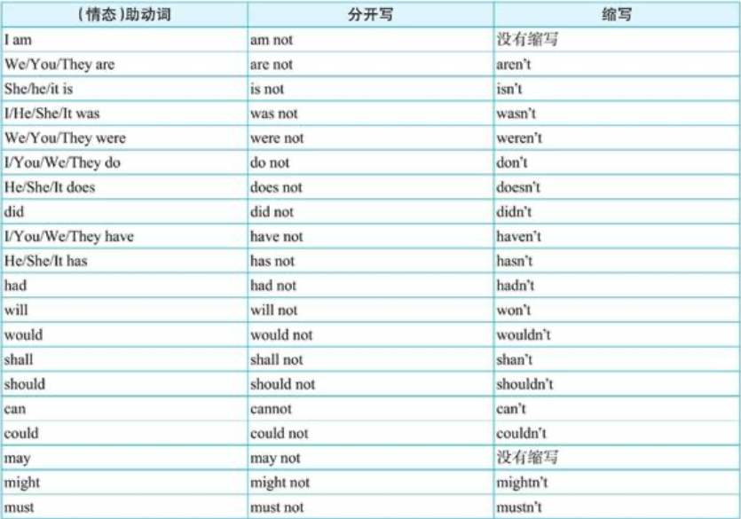
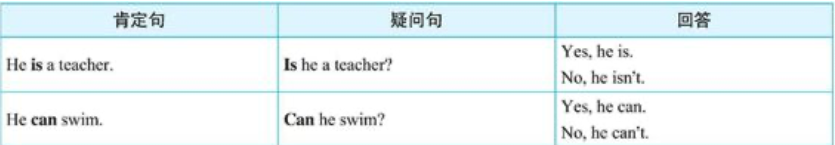
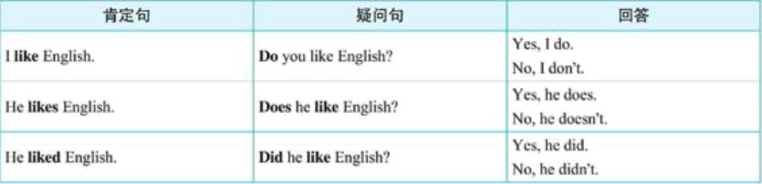
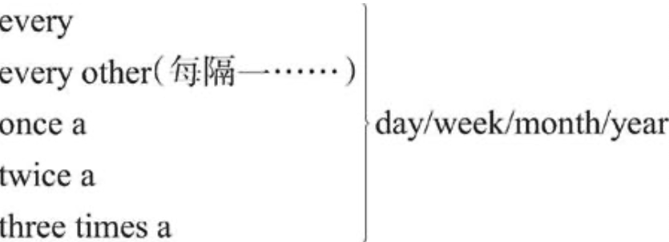

# 动词分类（一）：实义动词与（情态）助动词

根据动词的词义和在谓语中的作用，我们可以把动词分为**实义动词（notional verb）**、**助动词（auxiliary verb）**和**情态助动词（modal verb）**。

## 实义动词（notional verb）

实义动词的特点：
1. 从词义的角度来看，实义动词具备完整的词汇意义。
2. 从在谓语中的作用的角度来看，实义动词**能单独充当句子的谓语**。英语中除了助动词和情态动词以外，其他的均为实义动词。

## 助动词（auxiliary verb）

### 助动词be，do和have

助动词的特点：
1. 从词义的角度来看，助动词不具备词汇意义。
2. 从在谓语中的作用的角度来看，助动词不能单独充当句子的谓语，它必须和实义动词连用，以**帮助构成各种时态、语态、语气、否定和疑问等**。

英语的助动词有三个：be，do和have，它们分别具有各种变化形式。如下：
1. be: am, is, are, was, were, been, being
2. do: does, did
3. have: has, had, having

以上这些助动词及其各种变化形式的意义和用法我们将在以后的各章中详细讨论，在此仅举几例予以说明。请看下表：  

### 用作实义动词的be，do和have

## 情态助动词（modal verb）

情态动词的特点：
- 从词义的角度来看，情态动词有别于助动词。情态动词有其自身的词汇意义，如用来**表示可能、建议、愿望、必要、允许、能力、怀疑等等，以表示说话者对某种行为或状态的看法或态度**。
- 从在谓语中的作用的角度来看，与助动词一样，情态动词在句中不能单独作句子的谓语，而必须和实义动词一起构成复合谓语。

英文中的情态动词主要有下列10个：  
can/could, may/might, shall/should, will/would, must和had better。

另外还有一些与上述情态动词有关的短语动词：  
- be able to（与can类似）
- be going to（与will类似）
- ought to, be supposed to（与should类似）
- have to, have got to（与must类似）

此外，need和dare既可以用作情态动词，也可以用作实义动词。

## 陈述句的否定

陈述句的否定构成有两种：谓语中含有be动词或情态动词的，以及谓语是实义动词的。

### 谓语中含有be动词或情态动词的否定

这时直接在 be 动词或情态动词的后面加否定词 not 即构成否定句。请看下表中的例句比较：

### 谓语动词是实义动词的否定

这时陈述句的否定要借助助动词 do 及其各种变形来完成。  
如果是一般现在时的句子，谓语则是**do＋not＋动词原形**结构；若句子的主语是单数第三人称，谓语则用**does＋not＋动词原形**。  
如果是一般过去时的句子，则用**did＋not＋动词原形**。请看下表中的例句比较：

### 否定的缩写  

## 一般疑问句

一般疑问句的构成有两种：谓语中含有 be 动词或情态动词的，以及谓语是实义动词的。

### 谓语动词中含有be动词或情态动词的提问

这时要构成一般疑问句，只需将 be 动词或情态动词移到句首。

> 注意一般疑问句的回答方式：肯定回答用yes，否定回答用no。

### 谓语动词是实义动词的提问

如果句子是一般现在时，要借助助动词 do 或 does，将 do 或 does 放在句首。如果是一般过去时，则是将 did 放在句首，谓语动词变回动词原形。

## 特殊疑问句

特殊疑问句是在一般疑问句的基础上变化而来的，其句式为：“特殊疑问词＋一般疑问句＋？”。在英语中，特殊疑问词有who，what，which，when，where，why和how等。

### 不与名词连用的疑问词

- **对人提问-who**
  - **He** can sing in English. 他会唱英文歌。
  - **Who** can sing in English? 谁会唱英文歌？
  - I saw **him** at the party last night. 我昨晚在聚会上看到他了。
  - **Who** did you sec at the party last night? 你昨晚在聚会上看到谁了？
- **对事物或所做的事情提问-what**
  - I like **English**. 我喜欢英语。
  - **What** do you like? 你喜欢什么？
  - I am **studying English grammar**. 我正在学习英语语法。
  - **What** are you doing? 你在做什么？
- **对时间提问-when**
  - I was born **in 1980**. 我是1980年出生的。
  - **When** were you born? 你是什么时候出生的？
- **对地点提问-where**
  - He lives **in Beijing**. 他住在北京。
  - **Where** does he live? 他住在哪里？
- **对方式提问-how**
  - He goes to school **by bus**. 他坐公共汽车上学。
  - **How** does he go to school? 他怎么上学？
- **对原因提问-why**
  - I often study at the library **because it's quiet**. 我常常在图书馆学习，因为那里很安静。
  - **Why** do you often study at the library? 你为什么常常在图书馆学习？

### 要与名词连用的疑问词

- Which: 当说话者提供多种选项对象供对方选择时，我们就要用 which 来提问。此时，which 的后面通常要接一名词，意思是“哪一个什么东西”。
  - A: Could you lend me your pen? 你能把钢笔借给我用用吗？
  - B: Sure. I have two pens. This pen has black ink. That pen has red ink. **Which** pen/**Which** one/**Which** do you want? 当然可以。我有两支钢笔，这支是黑墨水的，那支是红墨水的，你想要哪支？
  - A: That red one. Thanks. 那支红墨水的。谢谢
  - 从以上例句可看出，which的后面也可不接名词，此时 which 用作**代词**。
- Whose: Whose 的后面必须接名词连用，表示“谁的什么东西”。
  - This is **his book**. 这是他的书。
  - **Whose book** is this? 这是谁的书？
  - I borrowed **Jack's car** last night. 我昨晚借了杰克的车。
  - **Whose car** did you borrow last night? 你昨晚借了谁的车？

### how的用法详解

#### how可以单独使用

how 单独使用时，此时 how 是对**动作的方式**进行提问。

- A: **How** did he break his leg? 他的腿是怎么断的？
- B: He fell off the ladder. 他从梯子上摔下来了，

#### how还常与形容词或副词连用
- 与形容词连用
  - **How old** are you? 你多大岁数？
  - **How tall** is he? 他身高多少？
  - **How big** is your new house? 你的新房子有多大？
  - **How far** is it from your home to school? 从你家到学校有多远？
- 与副词连用
  - **How well** does he speak English? 他英语说得怎么样？
  - **How quickly** can you get here? 你多快能到这里？

#### 对动作发生的频率提问-how often/how many times...?

- I write to my parents **once a month**. 我每个月给父母写一次信。
- **How often** do you write to your parents? 你多久给父母写一次信？
- I write to my parents **once** a month. 我每个月给父母写一次信
- **How many times a month** do you write to your parents? 你每个月给父母写几次信？

其他表示频率的短语还有：

<SideTitle :page="$page" />
