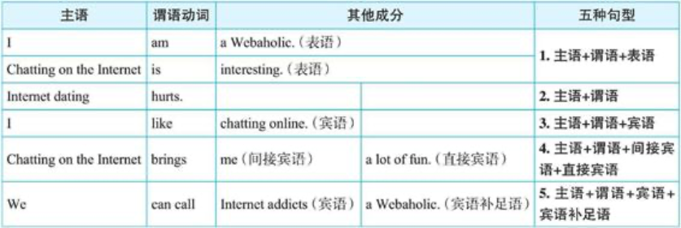

# 动词分类（二）：英语的五种基本句型

## 五种基本句型概述

### 主语＋谓语

一个完整的句子都由两部分组成：**陈述对象＋陈述内容**

这里的陈述对象一般是由名词或相当于名词的成分来充当，用语法术语来说叫做主语。  
而陈述内容则是说明主语怎么样了，都是用动词来表达，我们称之为谓语。  
因此，一个完整的英文句子就是：**主语＋谓语**或**名词＋动词**

### 五种基本句型概述

- I am a Webaholic. 我是一个网虫。
- I like chatting online. 我喜欢网上聊天。
- Chatting on the Internet is interesting. 网上聊天很有趣。
- Chatting on the Internet brings me a lot of fun. 网上聊天给我带来很多乐趣。
- We can call Internet addicts (上瘾的人) a Webaholic. 我们可以管网上瘾君子叫网虫。
- Internet dating hurts. 网恋有害。

我们可以说，**动词构成了一个句子的骨架结构**。因为是动词决定了一个句子是否有宾语、有几个宾语以及其他句子成分。

## 句型一：主语＋系动词＋表语

该句型的谓语动词是**系动词**（如be或其他系动词）。所谓系动词，又叫联系动词（linking verb），顾名思义，这种动词并不表示具体的动作，而只是起连接主语和后面成分的作用。这种动词后面所接的成分是用来说明主语的特点，表明主语的性质特征的，因此我们称之为主语补足语，或表语（能表示主语特征的成分）。

- He looks happy. 他看起来很高兴。

英文中最常见的系动词是be动词，其具体的形式有：am (I am), is (he is, she is, it is), are (you are, we are, they are)。  
其他的系动词还有：

- look（看起来是）
- sound（听起来是）
- smell（闻起来是）
- taste（尝起来是）
- feel（感觉是）
- seem（似乎是）
- appear（似乎是）
- become（变为）
- turn（转变为）

> 注意：副词一般不作表语，比如我们不能说：~~He looks happily~~ ❌

## 句型二：主语＋谓语

该句型的谓语动词是**不及物动词**（intransitive verb），所表示的动作没有作用对象，其本身的意思完整，其后不需带宾语。在词典中表示为vi.。

- He died. 他死了。
- These children are playing. 这些孩子正在玩耍。
- Internet dating hurts. 网恋有害。

这种句型中的谓语动词的后面虽然不接宾语，但通常会接副词（如hard）或介词短语（如in the west）来说明动作的方式、地点或时间等等。英文中把**这种修饰动作的成分称作状语**。

- The sun sets **in the west**.
- He works **hard**.

最后，需要能够区分“主系表”和“主谓状”两种句型。请注意比较：

- He shouted **loudly**. shouted是不及物动词，副词loudly修饰动作shouted，作状语。
- He looks **happy**. 形容词happy不是修饰looks的，而是补充说明主语he的特征，作表语。

## 句型三：主语＋谓语＋宾语

该句型的谓语动词是**及物动词**（transitive verb），这种动词告诉我们由主语发出的动作所作用的对象是什么，这里所作用的**对象**就是我们通常称之为**宾语**的，即宾语是主语动作的承受对象，因此这类动词是带有宾语的。英文中的绝大多数动词都是及物动词，在词典中标为vt.。

- I love **English**. 我喜欢英语。
- These children are playing **football**. 这些孩子正在踢足球。 play用作及物动词，其后面带有名词football作为play的作用对象，即宾语。
- These children are playing. 这些孩子正在玩要。 play用作不及物动词，其后面没有宾语。

由此可见，play 既可以用作及物动词，又可以用作不及物动词，但意思和用法都不一样。事实上，英语中大多数动词都像 play 一样，既可以用作及物动词，又可以用作不及物动词，但意思和用法都不一样。

此外，这种句型的宾语后面也可以接副词或介词短语作状语。例如：

- I like <u>chatting</u> **on the Internet**. 介词短语on the Internet修饰动作chatting，作状语。
- He speaks <u>English</u> **well**. 副词well修饰动作speaks，作状语。

## 句型四：主语＋谓语＋间接宾语＋直接宾语

该句型的谓语动词是**双宾动词**（dative verb），这种动词的后面所接成分有“**人**”又有“**物**”。一般来讲，这里的“人”表示动作的接受者，称作间接宾语（indirect object）。“物”表示动作作用的对象，是动作的承受者，称作直接宾语（direct object）。**间接宾语和直接宾语合起来叫做双宾语**。

主语＋谓语＋间接宾语（人）＋直接宾语（物）

- Chatting online will bring you a lot of fun. 网上聊天会给你带来很多乐趣。
- He lent me ten yuan. 他借给我10块钱。
- I will buy you a meal. 我会请你吃顿饭。
- l gave him my book. 我把我的书给他了。
- He showed the guard his passport. 他把通行证给门卫看了。

上述例句中的you, me, him和the guard都是间接宾语，表示“人”；a lot fun, ten yuan, a meal, my book和his passport都是直接宾语，表示“物”。

## 句型五：主语＋谓语＋宾语＋宾语补足语

该句型中的谓语动词是**宾补动词**（factitive verb），这种动词的后面接宾语，而此宾语的后面又接补充说明宾语的补足语（object complement）。**宾语和宾语补足语合起来叫做复合宾语**。

- We can call Internet addicts **a Webaholic**. 我们可以管网上瘾君子叫网虫。
- We elected John **chairman**. 我们选约翰作主席。
- I found this answer **wrong**. 我发现这个答案是错误的。
- You can leave the door **open**. 你可以把门开着。
- A hedge (树篱) between keeps friendship **green**. 保持距离，友谊长青。（这句话可引申为“君子之交淡如水”。）

上述例句中的加粗部分都是补足语，补充说明前面的宾语。比如我们若只说You can leave the door.就表示“你可以把门”，这句话的意思显然不完整，于是我们要对宾语the door进一步补充说明一下，说成You can leave the door open.这样句子的意思才完整。

### 区分双宾语和复合宾语

方法就是**在宾语的后面加上 be 动词，若能构成一个语义通顺的句子，则是补足语**。

因为宾语与宾语补足语的语义关系就相当于主语与主语补足语的关系，即类似一个“主系表”结构，所以，在宾语的后面添上一个系动词be，自然就应该能构成一个逻辑语义通顺的句子。而间接宾语与直接宾语之间就没有这样的语义关系，所以，添上be之后，自然就不能构成一个语义通顺的句子。

- I made John our chairman. 我选了约翰当我们的主席。**宾语＋宾语补足语**：在宾语 John 的后面添上一个 is，即 John is our chairman. 这说得通，所以 our chairman 是宾语补足语。
- I made John a cake. 我给约翰做了一块蛋糕。**间接宾语＋直接宾语**：在宾语 John 的后面添上一个 is，即 John is a cake.（约翰是一块蛋糕。）这显然讲不通，所以这里是一个双宾语结构，a cake 是一个直接宾语。

<SideTitle :page="$page" />
