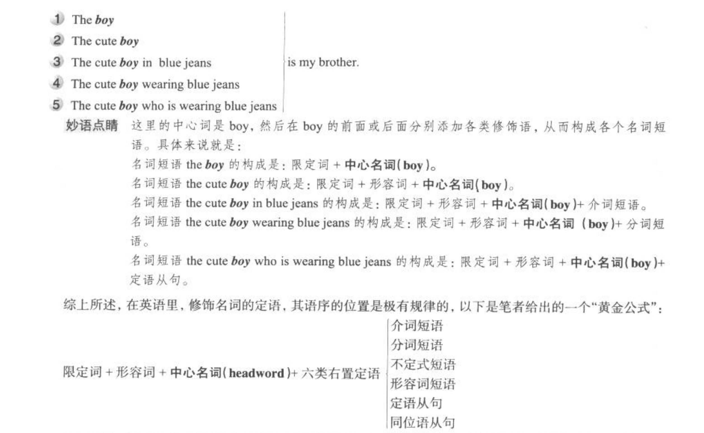

# 名词

## 名词短语

名词短语结构：

- 名词 + 名词修饰语 => 前置定语/定语
- 名字修饰语 + 名字 => 后置定语

### 名词前置定语

名词前有两种修饰语：

- 限定词 限定名词所指范围，对名字进行泛指、特指、定量或不定量等限定修饰   these、three、a、the、my 和 that

- 形容词 用来表示名词的性质和特征

### 名词后置定语

名词可以带的后置修饰语种类很多，分为：

- 定语从句
- 同谓语从句
- 分词短语
- 不定式
- 介词短语
- 形容词短语
- 副词短语

## 英语句子五成分论

句子层：主语、谓语、宾语、不语、状语

短语层：定语

定语是组成名词短语的成分，然后通过名词短语间接构成句子成分

##

