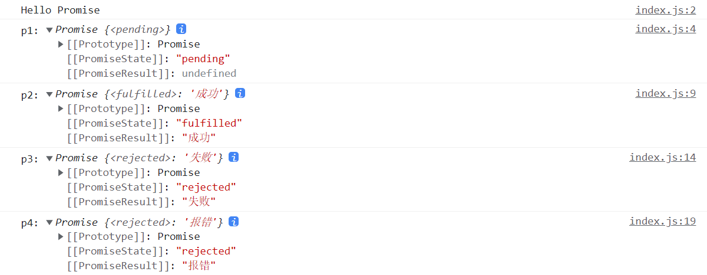
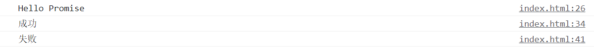
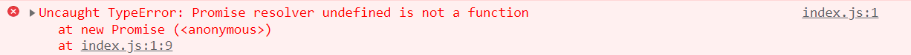
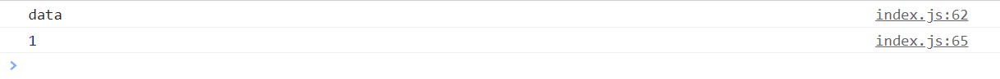
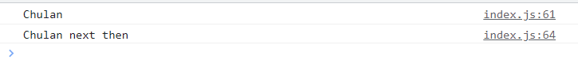

# 手写-Promise

先来几段Promsie的基本用例，先对Promise有一个快速的了解。

```js
const p1 = new Promise((resolve, reject) => {
  console.log('Hello Promise')
})
console.log('p1:', p1)

const p2 = new Promise((resolve, reject) => {
  resolve('成功')
})
console.log('p2:', p2)

const p3 = new Promise((resolve, reject) => {
  reject('失败')
})
console.log('p3:', p3)

const p4 = new Promise((resolve, reject) => {
  throw('报错')
})
console.log('p4:', p4)
```


这里可以得出4个知识点。
- 1.Promise初始状态为 pending
- 2.Promise执行 `resolve()` ，Promise状态变为 `fulfilled` ，即**已完成状态**
- 3.Promise执行 `reject()` ，Promise状态变为 `rejected` ，即**被拒绝状态**
- 4.Promise中有 throw 的话，就相当于执行了 `reject()`

```js
const p1 = new Promise((resolve, reject) => {
  console.log('Hello Promise')
}).then(() => {
  console.log('p1 then方法执行了')
})

const p2 = new Promise((resolve, reject) => {
  resolve('成功')
}).then(data => {
  console.log(data)
})


const p3 = new Promise((resolve, reject) => {
  reject('失败')
}).then(() => {}, err => {
  console.log(err)
})
```


这里可以得出3个知识点。
- 1.Promise里没有执行 `resolve()`、`reject()`以及 `throw` 的话，这个 Promise 的状态也是 `pending`
- 2.基于上一条，pending 状态下 Promise 不会执行 `then()` 方法
- 3.Promise执行 `resolve()` 方法后，`resolve()` 方法传递的值会被 `then()` 方法的第一个参数（函数）接收
- 4.Promise执行 `reject()` 方法后，`reject()` 方法传递的值会被 `then()` 方法的第二个参数（函数）接收

最后需要注意。
```js
const p = new Promise()
console.log('p', p)
```


- 规定必须给 Promise 对象传入一个执行函数，否则将会报错

## Promise-初见雏形

根据上面几个案例的总结我们可以得出一个基本框架

```js
class MyPromise{
  constructor(executor){
    // 初始化state为等待态
    this.state = 'pending';
    // 成功的值
    this.value = undefined;
    // 失败的原因
    this.reason = undefined;

    const resolve = value => {
      // state改变,resolve调用就会失败
      if (this.state === 'pending') {
        // resolve调用后，state转化为成功态
        this.state = 'fulfilled';
        // 储存成功的值
        this.value = value;
      }
    };

    const reject = reason => {
      // state改变,reject调用就会失败
      if (this.state === 'pending') {
        // reject调用后，state转化为失败态
        this.state = 'rejected';
        // 储存失败的原因
        this.reason = reason;
      }
    };

    executor(resolve, reject);
  }

  then(onFulfilled,onRejected) {
    // 状态为fulfilled，执行onFulfilled，传入成功的值
    if (this.state === 'fulfilled') {
      onFulfilled(this.value);
    };
    // 状态为rejected，执行onRejected，传入失败的原因
    if (this.state === 'rejected') {
      onRejected(this.reason);
    };
  }
}
```


## Promise-异步实现完善

先看一段示例代码
```js
const p = new MyPromise((resolve, reject) => {
  setTimeout(() => {
    resolve('成功')
  }, 2000)
})

p.then(data => {
 console.log('data', data); 
})
```

正常来讲，上述代码会在 2s 后输出成功，但是现在代码并没有输出任何信息，这是为什么呢？

原因很简单，因为我们之前代码实现的逻辑全是同步的。但是上述代码实例化一个 Promise 的构造函数式，会在 `setTimeout` 逻辑中调用 `resolve()` ，也就是 2s 后才会改变状态，结合我们实现的 `then()` 方法，onFulfilled是同步执行的，它执行的时候 this.state 仍然为 `pending`,并没有做到 2s 后再执行 onFulfilled

那么改怎么办呢？我们似乎应该在合适的时间去调用 onFulfilled 方法，这个合适的时间是开发者调用 `resolve()` 的时刻，那么我们现在状态（ state ）为 pending 时把开发者传过来的 onFulfilled 方法存起来，再在 resolve 方法中执行即可。

```js
class MyPromise{
  constructor(executor){
    this.state = 'pending';
    this.value = undefined;
    this.reason = undefined;
    // 存放成功函数
    this.onFulfilledFunc = Function.prototype;
    // 存放失败函数
    this.onRejectedFunc = Function.prototype;
    const resolve = value => {
      if (this.state === 'pending') {
        this.state = 'fulfilled';
        this.value = value;
        // 一旦resolve执行，调用存放成功的函数
        this.onFulfilledFunc(this.value)
      }
    };
    const reject = reason => {
      if (this.state === 'pending') {
        this.state = 'rejected';
        this.reason = reason;
        // 一旦reject执行，调用存放失败的函数
        this.onRejectedFunc(this.reason)
      }
    };
    executor(resolve, reject);
  }
  then(onFulfilled,onRejected) {
    if (this.state === 'fulfilled') {
      onFulfilled(this.value);
    };
    if (this.state === 'rejected') {
      onRejected(this.reason);
    };
    // 当状态state为pending时
    if (this.state === 'pending') {
      this.onFulfilledFunc = onFulfilled
      this.onRejectedFunc = onRejected
    }
  }
}
```

通过测试刚刚的代码发现，我们实现的代码可以支持异步执行了！不过又有一个新的问题，再来看一个例子

```js
const p = new MyPromise((resolve, reject) => {
  resolve('data')
})

p.then(data => {
  console.log(data);
})

console.log(1);
```



正常情况，这里会按顺序输出1，在输出 data

而我们实现的代码却没有考虑这种情况，实际先输出了 data ，在输出1。因此，需要将 resolve 和 reject 的执行放到`任务队列`中。这里姑且先放到 setTimeout 中，保证异步执行（这样的做做法并不严谨，为了保证 Promise 属于 microtasks ，很多 Promise 的实现库用了 MutationObserver 来模仿 nextTick）。

```js
const resolve = value => {
  setTimeout(() => {
    if (this.state === 'pending') {
      this.state = 'fulfilled';
      this.value = value;
      this.onFulfilledFunc(this.value)
    }
  })
};
const reject = reason => {
  setTimeout(() => {
    if (this.state === 'pending') {
      this.state = 'rejected';
      this.reason = reason;
      this.onRejectedFunc(this.reason)
    }
  })
};
```

这样一来，再执行 executor(resolve, reject) 时，也能保证在 nextTick 中才去执行 Promise 被决议后的任务，不会阻塞同步任务。

## Promise-细节完善

### 多次调用then

到此为止，我们的 Promise 实现似乎越来越靠谱了，但是还有些细节需要完善。

比如，在 Promise 实例状态变更之前添加多个 then 方法。

```js
const p = new Promise((resolve, reject) => {
  setTimeout(() => {
    resolve('data')
  }, 2000)
})

p.then(data => {
  console.log('第一次调用then', data);
})

p.then(data => {
  console.log('第二次调用then', data);
})
```

以上代码会得到以下输出。


而我们应该得到 `第一次调用then data` `第二次调用then data`，这是因为第二个 then 方法中的 onFulfilledFunc 会覆盖第一个 then 中的 onFulfilledFunc。

这个问题也好解决，只需要将所有 then 方法中的 onFulfilledFunc 存储到一个数组 onFulfilledArray 中，在当 Promise 被决议时依次执行 onFulfilledArray 数组内的方法即可。对于 onRejectFunc 同理，改动后的代码如下:。

```js
class MyPromise{
  constructor(executor){
    this.state = 'pending';
    this.value = undefined;
    this.reason = undefined;
    // 存放成功函数
    this.onFulfilledArray = [];
    // 存放失败函数
    this.onRejectedArray = [];

    const resolve = value => {
      setTimeout(() => {
        if (this.state === 'pending') {
          this.state = 'fulfilled';
          this.value = value;
          this.onFulfilledArray.forEach(fn => fn(value))
        }
      })
    };
    const reject = reason => {
      setTimeout(() => {
        if (this.state === 'pending') {
          this.state = 'rejected';
          this.reason = reason;
          this.onRejectedArray.forEach(fn => fn(reason))
        }
      })
    };
    
    executor(resolve, reject);
  }
  then(onFulfilled,onRejected) {
    if (this.state === 'fulfilled') {
      onFulfilled(this.value);
    };
    if (this.state === 'rejected') {
      onRejected(this.reason);
    };
    // 当状态state为pending时
    if (this.state === 'pending') {
      this.onFulfilledArray.push(onFulfilled)
      this.onRejectedArray.push(onRejected)
    }
  }
}
```

### onFulfilled 为 Promise 的判断

如果 resolve 的内容还是一个 Promise 的话需要得到该 Promise 决议的结果再次传给 resolve。

```js
const resolve = value => {
  if (value instanceof MyPromise) {
    return value.then(resolve, reject)
  }

  setTimeout(() => {
    if (this.state === 'pending') {
      this.state = 'fulfilled';
      this.value = value;
      this.onFulfilledArray.forEach(fn => fn(value))
    }
  })
};
```

### Promise 穿透
根据 [Promise/A+ 规范](https://promisesaplus.com/)规定，then 方法里面的两个参数如果不是函数的话就要被忽略。

所以then方法的 onFulfilled 和 onRejected 参数需要加入函数校验。

```js
then(onFulfilled, onRejected) {
  onFulfilled = typeof onFulfilled === 'function' ? onFulfilled : value => value;
  onRejected = typeof onRejected === 'function' ? onRejected : reason => { throw reason };
  
  if (this.state === 'fulfilled') {
    onFulfilled(this.value);
  };
  if (this.state === 'rejected') {
    onRejected(this.reason);
  };
  // 当状态state为pending时
  if (this.state === 'pending') {
    this.onFulfilledArray.push(onFulfilled)
    this.onRejectedArray.push(onRejected)
  }
}
```

### 构造函数出错
另外一个需要完善的细节是，在构造函数中如果出错，将会自动触发 Promise 实例状态变为 rejected，因此我们用 try...catch 块对 executor 进行包裹，如下。

```js
try {
  executor(resolve, reject);
} catch (err) {
  reject(err)
}
```

到目前为止，我们已经初步实现了基本的 Promise。得到一个好的实现结果固然重要，但是在实现过程中，我们也加深了对 Promise 的理解，得出下面一些重要结论。
- Promise 的状态具有凝固性
- Promise 可以在 then 方法的第二个参数中进行错误处理
- Promise 实例可以添加多个 then 处理场景

距离完整的实现越来越近，接下来实现 Promise then 的链式调用效果。

## Promise-then的链式调用

在正式介绍此部分知识前，我们先来看一道题目：请判断一下代码的输出结果。

```js
const p = new Promise((resolve,reject) => {
  setTimeout(() => {
    resolve('Chulan')
  }, 2000);
})

p.then(data => {
  console.log(data);
  return `${data} next then`
}).then(data => {
  console.log(data);
})
```



我们看到，Promise 实例的 then 方法支持链式调用，输出经过 resolve 处理后的值后，如果在 then 方法体的 onFulfilled 函数同步显示返回新的值，则将会在新 Promise 实例 then 方法的 onFulfilled 函数中输出新值。

如果在第一个 then 方法体的 onFulfilled 函数中返回另一个 Promise 实例，结果又将如何呢？请看以下代码。

```js
const p = new Promise((resolve,reject) => {
  setTimeout(() => {
    resolve('Chulan')
  }, 2000);
})

p.then(data => {
  console.log(data);
  return new Promise((resolve,reject) => {
    setTimeout(() => {
      resolve(`${data} next then`)
    }, 4000);
  })
}).then(data => {
  console.log(data);
})
```

上述代码将在 2s 后输出 Chualn ，紧接着再过 4s (第 6s )输出 Chulan next then。

由此可知，一个 Promise 实例 then 方法的 onFulfilled 函数和 onRejected 函数支持返回一个非 Promise 实例的`普通值`，也是支持再次返回一个` Promise 实例`的；并且，返回的这个`普通值`或` Promise 实例`将会传给下一个 then 方法的 onFulfilled 函数或 onRejected 函数，这样 then 方法就可以支持链式调用了。

## Promise-链式调用初步实现

根据 [Promise/A+ 规范](https://promisesaplus.com/)规定，then 方法必须返回一个新的 Promise 实例（后面会判断返回普通值的情况），即 promise2，最终代码如下。

```js
then(onFulfilled, onRejected) {
    onFulfilled = typeof onFulfilled === 'function' ? onFulfilled : value => value;
    onRejected = typeof onRejected === 'function' ? onRejected : reason => { throw reason };

    let promise2
    if (this.state === 'fulfilled') {
      return promise2 = new MyPromise((resolve, reject) => {
        setTimeout(() => {
          try {
            // 这个新的 promise2 resolved的值为 onFulfilled 的执行结果
            let result = onFulfilled(this.value);
            resolve(result)
          } catch (err) {
            reject(err)
          } 
        });
      })
    };

    if (this.state === 'rejected') {
      return promise2 = new MyPromise((resolve, reject) => {
        setTimeout(() => {
          try {
            // 这个新的 promise2 的经过 reject 处理后的值为 onRejected 的执行结果
            let result = onRejected(this.reason);
            resolve(result)
          } catch (err) {
            reject(err)
          } 
        });
      })
    };
    
    if (this.state === 'pending') {
      return promise2 = new MyPromise((resolve, reject) => {
        this.onFulfilledArray.push(value => {
          try {
            let result = onFulfilled(value);
            resolve(result)
          } catch (err) {
            reject(err)
          } 
        })
        this.onRejectedArray.push(reason => {
          try {
            let result = onRejected(reason);
            resolve(result)
          } catch (err) {
            reject(err)
          } 
        })
      })
    }
  }
```

这里重点要了解 this.state === 'pending' 判断分支中的逻辑，这也是最难理解的。当使用 Promise 实例调用其 then 方法时，应该返回一个 Promise 实例，返回的就是this.state === 'pending' 判断分支中返回的 promise2。那么，这个 promise2 什么时候被决议呢？应该是在异步处理结束后，依次执行 onFulfilledArray 或 onRejectedArray 数组中的函数。

我们在思考一下，onFulfilledArray 或 onRejectedArray 数组中的函数应该做些什么呢？很明显，需要切换 promise2 的状态，并进行决议。

理顺了 onFulfilledArray 或 onRejectedArray 数组中的函数需要执行的逻辑，在进行改动。将 this.onFulfilledArray.push(onFulfilled) 的函数由。

```js
this.onFulfilledArray.push(onFulfilled)
```

改为以下形式。

```js
this.onFulfilledArray.push(() => {
  try {
    let result = onFulfilled(this.value);
    resolve(result)
  } catch (err) {
    reject(err)
  } 
})
```

this.onRejectedArray.push 函数的改动方式同理。

这里的改动非常不容易，如果仍然想不明白，也不需要着急，还是应该先理解透 Promise 在返回来看，多看几次，一定会有所收货。

请注意此时 Promise 实现的完整代码如下。

```js
class MyPromise{
  constructor(executor){
    this.state = 'pending';
    this.value = undefined;
    this.reason = undefined;
    this.onFulfilledArray = [];
    this.onRejectedArray = [];

    const resolve = value => {
      if (value instanceof MyPromise) {
        return value.then(resolve, reject)
      }

      setTimeout(() => {
        if (this.state === 'pending') {
          this.state = 'fulfilled';
          this.value = value;
          this.onFulfilledArray.forEach(fn => fn(value))
        }
      })
    };
    const reject = reason => {
      setTimeout(() => {
        if (this.state === 'pending') {
          this.state = 'rejected';
          this.reason = reason;
          this.onRejectedArray.forEach(fn => fn(reason))
        }
      })
    };
    
    try {
      executor(resolve, reject);
    } catch (err) {
      reject(err)
    }
  }
  
  then(onFulfilled, onRejected) {
    onFulfilled = typeof onFulfilled === 'function' ? onFulfilled : value => value;
    onRejected = typeof onRejected === 'function' ? onRejected : reason => { throw reason };

    let promise2
    if (this.state === 'fulfilled') {
      return promise2 = new MyPromise((resolve, reject) => {
        setTimeout(() => {
          try {
            // 这个新的 promise2 resolved的值为 onFulfilled 的执行结果
            let result = onFulfilled(this.value);
            resolve(result)
          } catch (err) {
            reject(err)
          } 
        });
      })
    };

    if (this.state === 'rejected') {
      return promise2 = new MyPromise((resolve, reject) => {
        setTimeout(() => {
          try {
            // 这个新的 promise2 的经过 reject 处理后的值为 onRejected 的执行结果
            let result = onRejected(this.reason);
            resolve(result)
          } catch (err) {
            reject(err)
          } 
        });
      })
    };
    
    if (this.state === 'pending') {
      return promise2 = new MyPromise((resolve, reject) => {
        this.onFulfilledArray.push(value => {
          try {
            let result = onFulfilled(value);
            resolve(result)
          } catch (err) {
            reject(err)
          } 
        })
        this.onRejectedArray.push(reason => {
          try {
            let result = onRejected(reason);
            resolve(result)
          } catch (err) {
            reject(err)
          } 
        })
      })
    }
  }
}
```

## Promise-链式调用完整实现

先看两个例子。

```js
// onFulfilled返回 普通值
const p = new Promise((resolve,reject) => {
  setTimeout(() => {
    resolve('Chulan')
  }, 2000);
})

p.then(data => {
  console.log(data);
  return `${data} next then`
}).then(data => {
  console.log(data);
})

// onFulfilled返回 promise 实例
const p = new Promise((resolve,reject) => {
  setTimeout(() => {
    resolve('Chulan')
  }, 2000);
})

p.then(data => {
  console.log(data);
  return new Promise((resolve,reject) => {
    setTimeout(() => {
      resolve(`${data} next then`)
    }, 4000);
  })
}).then(data => {
  console.log(data);
})
```

根据以上两个例子结合上一栏实现的代码可知，let result = onFulfilled(this.value) 或 let result = onRejected(this.reason) 语句中，result 可能是一个普通值，也可能是一个 Promise 实例，为此我们可以抽象出 resolvePromise 方法([Promise/A+ 规范](https://promisesaplus.com/)规定) 进行统一处理，并用 x 变量替换 result。

```js
/**
 * @param {*} promise2 返回的 promise 实例
 * @param {*} x onFulfilled 或 onRejected 函数的返回值
 * @param {*} resolve promise2 的 resolve 方法
 * @param {*} reject promise2 的 reject 方法
 */
const resolvePromise = (promise2, x, resolve, reject) => {
  // 当 x 和 promise2 相等时，也就是在 onFulfilled 返回 promise2 时，执行 reject
  if (x === promise2) {
    reject(new TypeError('error due to circular reference'))
  }

  // 是否已经执行过 onFulfilled 或 onRejected
  let consumed = false // 初始未执行
  let thenable

  // 如果 x 为 Promise ，则使 promise2 接受 x 的状态
  if (x instanceof MyPromise) {
    if (x.state === 'pending') {
    // 如果 x 处于等待态， promise 需保持为等待态直至 x 被执行或拒绝
    // 注意"直至 x 被执行或拒绝"这句话，
    // 这句话的意思是：x 被执行x，如果执行的时候拿到一个y，还要继续解析y
      x.then(function (data) {
        resolvePromise(promise2, data, resolve, reject)
      }, reject)
    } else {
      x.then(resolve, reject)
    }
    return 
  }

  let isComplexX = target => (typeof target === 'function' || typeof target === 'object') && (target !== null)

  // 如果返回的是疑似 Promise 类型
  if (isComplexX) {
    try {
      thenable = x.then
      // 判断返回值是否是 Promise 类型
      if (typeof thenable === 'function') {
        thenable.call(x, function (data) {
          if (consumed) return
          consumed = true

          return resolvePromise(promise2, data, resolve, reject)
        }, function (err) {
          if (consumed) return
          consumed = true
          
          return reject(err)
        }
        )
      } else {
        resolve(x)
      }
    } catch (err) {
      if (consumed) return
      consumed = true

      return reject(err)
    }
  } else {
    resolve(x)
  }
}
```

我们看到，resolvePromise 方法的第一步就是对 “死循环” 进行处理，并再发生死循环是抛出错误。其中出现 “死循环” 的情况如下所示。

```js
const promise = new MyPromise((resolve, reject) => {
  resolve(100)
})
const p1 = promise.then(value => {
  console.log(value)  
  return p1
})
```

接着，对于 onFulfilled 函数返回的结果 x；如果 x 不是 Promise 实例，不是对象，也不是函数，而是一个普通值的话( isComlexX 函数用于此进行判断)，则直接对 promise2 进行决议。

对于 onFulfilled 函数返回的结果 x；如果 x 含有 then 属性方法，那么我们称该属性方法为 thenable，说明 x 是一个 Promise 实例，当执行该实例的 then 方法(即 thenable )是，返回结果可能还是一个 Promise 实例类型，也可能是一个普通值，因此还要递归调用 resolvePromise。如果不明白为什么要递归调用 resolvePromise，那么可以看一下下面的代码。

```js
const p = new MyPromise((resolve, reject) => {
  setTimeout(() => {
    resolve('Chulan')
  }, 2000)
})

p.then(data => {
  console.log(data);
  return new MyPromise((resolve, reject) => {
    setTimeout(() => {
      resolve(`${data} next then`)
    }, 4000);
  }).then(data => {
    return new MyPromise((resolve, reject) => {
      setTimeout(() => {
        resolve(`${data} next then`)
      }, 4000);
    })
  })
})
.then(data => {
  console.log(data);
})
```

以上代码将会在 2s 时输出 Chulan，在 10s 时输出 Chulan next then next then。

此时，Promise 实现的完整代码如下。

```js
class MyPromise{
  constructor(executor){
    this.state = 'pending';
    this.value = undefined;
    this.reason = undefined;
    this.onFulfilledArray = [];
    this.onRejectedArray = [];

    const resolve = value => {
      if (value instanceof MyPromise) {
        return value.then(resolve, reject)
      }

      setTimeout(() => {
        if (this.state === 'pending') {
          this.state = 'fulfilled';
          this.value = value;
          this.onFulfilledArray.forEach(fn => fn(value))
        }
      })
    };
    const reject = reason => {
      setTimeout(() => {
        if (this.state === 'pending') {
          this.state = 'rejected';
          this.reason = reason;
          this.onRejectedArray.forEach(fn => fn(reason))
        }
      })
    };
    
    try {
      executor(resolve, reject);
    } catch (err) {
      reject(err)
    }
  }

  then(onFulfilled, onRejected) {
    onFulfilled = typeof onFulfilled === 'function' ? onFulfilled : value => value;
    onRejected = typeof onRejected === 'function' ? onRejected : reason => { throw reason };

    let promise2
    if (this.state === 'fulfilled') {
      return promise2 = new MyPromise((resolve, reject) => {
        setTimeout(() => {
          try {
            // 这个新的 promise2 resolved的值为 onFulfilled 的执行结果
            let x = onFulfilled(this.value);
            resolvePromise(promise2, x, resolve, reject)
          } catch (err) {
            reject(err)
          } 
        });
      })
    };

    if (this.state === 'rejected') {
      return promise2 = new MyPromise((resolve, reject) => {
        setTimeout(() => {
          try {
            // 这个新的 promise2 的经过 reject 处理后的值为 onRejected 的执行结果
            let x = onRejected(this.reason);
            resolvePromise(promise2, x, resolve, reject)
          } catch (err) {
            reject(err)
          } 
        });
      })
    };
    
    if (this.state === 'pending') {
      return promise2 = new MyPromise((resolve, reject) => {
        this.onFulfilledArray.push(value => {
          try {
            let x = onFulfilled(value);
            resolvePromise(promise2, x, resolve, reject)
          } catch (err) {
            reject(err)
          } 
        })
        this.onRejectedArray.push(reason => {
          try {
            let x = onRejected(reason);
            resolvePromise(promise2, x, resolve, reject)
          } catch (err) {
            reject(err)
          } 
        })
      })
    }
  }
}

/**
 * @param {*} promise2 返回的 promise 实例
 * @param {*} x onFulfilled 或 onRejected 函数的返回值
 * @param {*} resolve promise2 的 resolve 方法
 * @param {*} reject promise2 的 reject 方法
 */
const resolvePromise = (promise2, x, resolve, reject) => {
  // 当 x 和 promise2 相等时，也就是在 onFulfilled 返回 promise2 时，执行 reject
  if (x === promise2) {
    reject(new TypeError('error due to circular reference'))
  }

  // 是否已经执行过 onFulfilled 或 onRejected
  let consumed = false // 初始未执行
  let thenable

  // 如果 x 为 Promise ，则使 promise2 接受 x 的状态
  if (x instanceof MyPromise) {
    if (x.state === 'pending') {
    // 如果 x 处于等待态， promise 需保持为等待态直至 x 被执行或拒绝
    // 注意"直至 x 被执行或拒绝"这句话，
    // 这句话的意思是：x 被执行x，如果执行的时候拿到一个y，还要继续解析y
      x.then(function (data) {
        resolvePromise(promise2, data, resolve, reject)
      }, reject)
    } else {
      x.then(resolve, reject)
    }
    return 
  }

  let isComplexX = target => (typeof target === 'function' || typeof target === 'object') && (target !== null)

  // 如果返回的是疑似 Promise 类型
  if (isComplexX(x)) {
    try {
      thenable = x.then
      // 判断返回值是否是 Promise 类型
      if (typeof thenable === 'function') {
        thenable.call(x, function (data) {
          if (consumed) return
          consumed = true

          return resolvePromise(promise2, data, resolve, reject)
        }, function (err) {
          if (consumed) return
          consumed = true
          
          return reject(err)
        })
      } else {
        resolve(x)
      }
    } catch (err) {
      if (consumed) return
      consumed = true

      return reject(err)
    }
  } else {
    resolve(x)
  }
}
```

## Promise 静态方法和其他方法实现

接下来我们将实现以下方法。
- Promise.protptype.catch
- Promise.resolve
- Promise.reject
- Promise.all
- Promise.race

### Promise.protptype.catch 实现

Promise.protptype.catch 可以用来进行异常捕获，它的典型用法如下。

```js
const p = new Promise((resolve, reject) => {
  setTimeout(() => {
    reject('Chulan error')
  }, 2000);
})

p.then(data => {
  console.log(data);
}).catch(error => {
  console.log(error);
})
```

以上代码会在 2s 后输出 Chulan error。

其实在这种场景下，它与以下代码是等价的。

```js
MyPromise.prototype.catch = function (catchFn) {
  return this.then(null, catchFn)
}
```

因为我们知道 .then() 方法的第二个参数也就是进行异常捕获的，所以通过这个特性，我们可以比较简单地实现 Promise.protptype.catch。

### Promise.resolve 实现

MDN 上对于 Promise.resolve(value) 方法的介绍是这样的：Promise.resolve(value) 方法返回一个以给定值解析后的 Promise 实例对象。

我们来看一个示例，如下。

```js
Promise.resolve('data').then(data => {
  console.log(data);
})
console.log(1);
```

执行以上代码将先输出 1，在输出 data。

那么实现 Promise.resolve(value) 也很简单，具体代码如下。

```js
MyPromise.resolve = function (value) {
  return new MyPromise((resolve, reject) => {
      resolve(value)
  })
}
```

### Promise.reject 实现

根据 Promise.resolve(value) 实现原理，代码如下。

```js
MyPromise.reject = function (value) {
  return new MyPromise((resolve, reject) => {
      reject(value)
  })
}
```

### Promise.all 实现

MDN 上对于 Promise.all 的解释是：Promise.all(iterable) 方法返回一个 Promise 实例，此实例在 iterable 参数内的所有 Promise 实例都 `完成` ( resolved ) 或参数中不包括 Promise 实例时完成回调 ( resolved )；如果参数中 Promise 实例有一个失败 ( rejected ) ，则此实例回调失败 ( reject ) ，失败原因是第一个 Promise 实例失败的原因。

先通过一个例子来体会一下。

```js
const p1 = new Promise((resolve, reject) => {
  setTimeout(() => {
    resolve('Chulan1')
  }, 2000);
})

const p2 = new Promise((resolve, reject) => {
  setTimeout(() => {
    resolve('Chulan2')
  }, 2000);
})

Promise.all([p1, p2]).then(data => {
  console.log(data);
})
```

执行以上代码会执行 `['Chulan1', 'Chulan2']`

这里的 Promise.all 的实现思路也很简单，如下。

```js
MyPromise.all = function (promiseArray) {
  if (!Array.isArray(promiseArray)) throw new TypeError('The arguments should be an array!')

  return new MyPromise((resolve, reject) => {
    try {
      let resultArray = []
      const length = promiseArray.length

      for (let i = 0; i < length; i++) {
        promiseArray[i].then(data => {
          resultArray.push(data)

          if (resultArray.length === length) resolve(resultArray)
        }, reject)
      }
    } catch (error) {
      reject(error)
    }
  })
}
```

一个 Promise 实例，这个实例将会在 promiseArray 中的所有 Promise 实例被决议后进行决议，决议结果是一个数组，这个数组存有 promiseArray 重的所有 Promise 实例的决议值。

此实现的整体思路是依赖一个 for 循环对 promiseArray 进行遍历。同样按照这个思路，我们还可以对 Promise.race 进行实现。

### Promise.race 实现

先来看一下 Promise.race 的用法，如下所示。

```js
const p1 = new Promise((resolve, reject) => {
  setTimeout(() => {
    resolve('Chulan1')
  }, 2000);
})

const p2 = new Promise((resolve, reject) => {
  setTimeout(() => {
    resolve('Chulan2')
  }, 4000);
})

Promise.race([p1, p2]).then(data => {
  console.log(data);
})
```

执行以上代码，将会在 2s 后输出 Chulan1。实现 Promise.race 的代码如下。

```js
MyPromise.race = function (promiseArray) {
  if (!Array.isArray(promiseArray)) throw new TypeError('The arguments should be an array!')
  return new MyPromise((resolve, reject) => {
    try {
      const length = promiseArray.length

      for (let i = 0; i < length; i++) {
        promiseArray[i].then(resolve, reject)
      }
    } catch (error) {
      reject(error)
    }
  })
}
```

我们来简单分析一下，这里使用 for 循环同步执行 promiseArray 数组中所有 Promise 实例的 then 方法，第一个 resolve 的实例会直接触发新的 Promise 实例（ 代码中通过 new 新声明的 ）的 resolve 方法。

## 参考文章

《前端开发核心知识进阶》

[BAT前端经典面试问题：史上最最最详细的手写Promise教程](https://juejin.cn/post/6844903625769091079)

[手把手一行一行代码教你“手写Promise“，完美通过 Promises/A+ 官方872个测试用例](https://juejin.cn/post/7043758954496655397)

[看了就会，手写Promise原理，最通俗易懂的版本！！！](https://juejin.cn/post/6994594642280857630)


<SideTitle :page="$page" />

