# Git合并多次提交

## 背景

一个repo通常是由一个team中的多个人共同维护，如果需要增加新feature，那么就是一个feature分支了。由于开发中各种修改，本feature分支多次commit。最后提交master后，会看到乱七八糟的所有增量修改历史。其实对别人来说，我们的改动应该就是增加或者删除，给别人看开发过程的增量反而太乱。于是我们可以将feature分支的提交合并后然后再merge到主干这样看起来就清爽多了。

记得知乎上有个帖子提问为啥vue的作者尤大大在开发vue的时候，提交历史能做到如此清爽。

## 简介

rebase的作用简要概括为：可以对某一段线性提交历史进行编辑、删除、复制、粘贴；因此，合理使用rebase命令可以使我们的提交历史干净、简洁！

但是需要的是：

::: warning
- 不要通过rebase对任何已经提交到公共仓库中的commit进行修改（你自己一个人玩的分支除外）
:::

[Git commits历史是如何做到如此清爽的? - 知乎](https://www.zhihu.com/question/61283395)

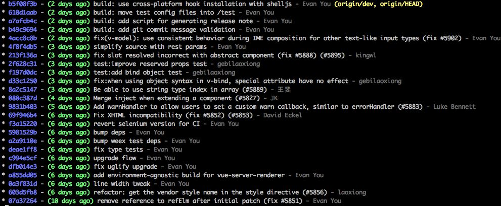

## Source tree

如下图，现在user模块有一个新功能，但是有3个模块，分别做了3次提交，完成测试之后准备合并master，但是现在直接和过去会有3次记录会比较乱。可以利用rebase合并三次提交未一次提交，在合并到master会更清晰。

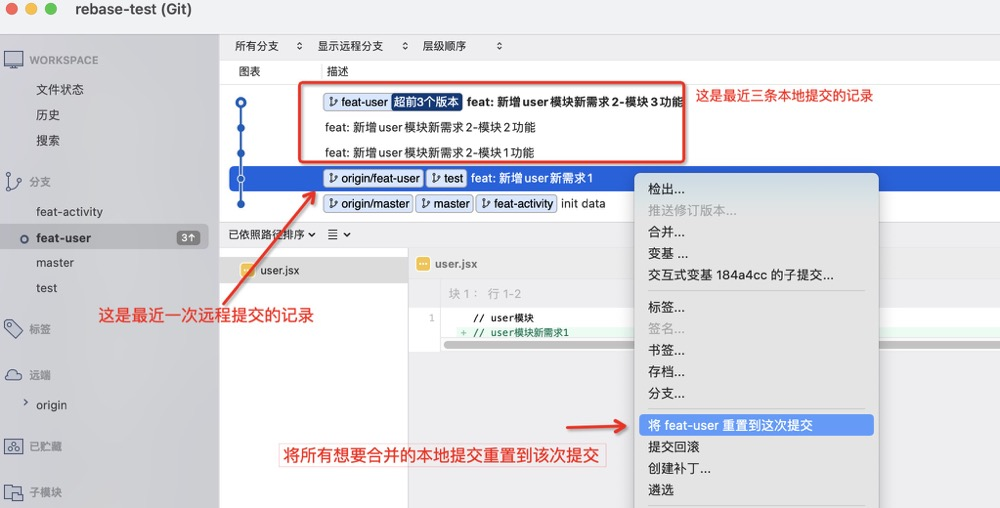

选择混合合并


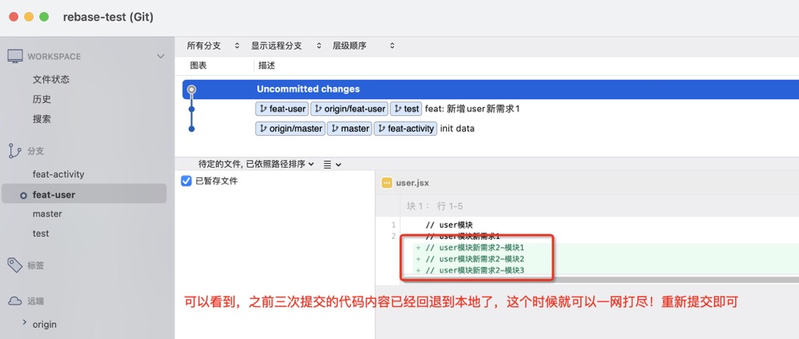

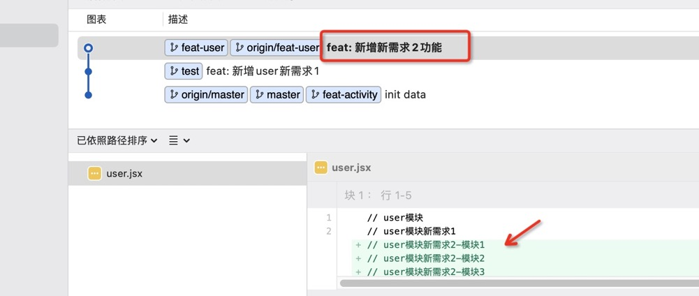

## 命令行

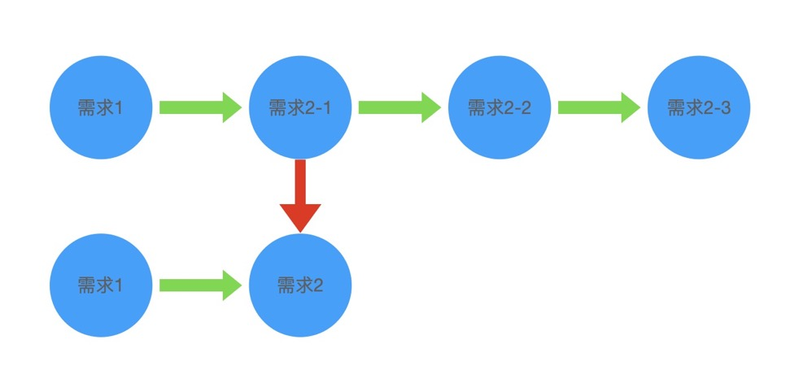

将需求2提交的三次改动合并未一次，可以使用命令：

```git
git rebase -i  [startpoint]  [endpoint]
或
git rebase -i HEAD~3 // 编辑最近3次提交
```

其中-i的意思是--interactive，即弹出交互式的界面让用户编辑完成合并操作，[startpoint] [endpoint]则指定了一个编辑区间，如果不指定[endpoint]，则该区间的终点默认是当前分支HEAD所指向的commit(注：该区间指定的是一个前开后闭的区间)。 

我们可以运行 `git log --oneline` 查看当前分支提交记录

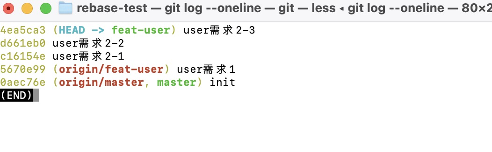

在查看到了log日志后，我们运行以下命令：

```git
git rebase -i HEAD~3
```

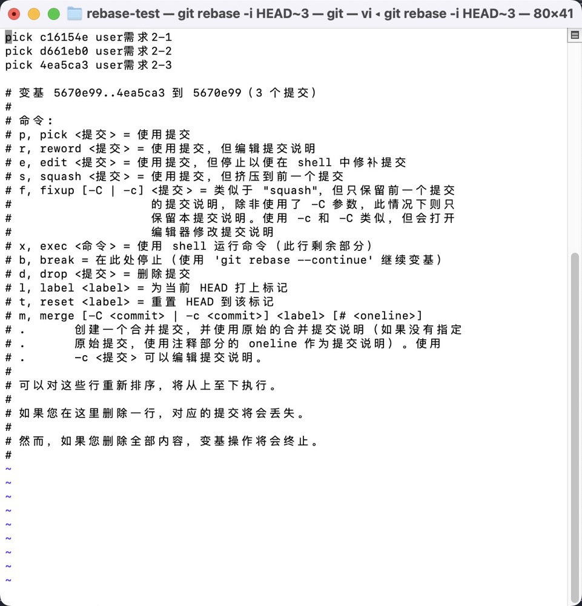

这时会弹出现目的编辑窗口：

这是一个vim编辑的文本，需要使用vim命令进行编辑。

- 首先，输入i命令，进入编辑模式。
- 我们需要关注的是最上面几行以pick开头的信息。需要把除了第一行外的pick改成s。

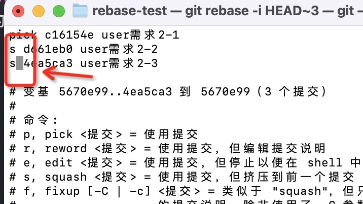

- 然后按esc键退出输入模式，输入:(英文冒号)进入底线命令模式
- 再输入wq 即保存(enter)后退出

之后会展示如下界面，进行提交注释处理

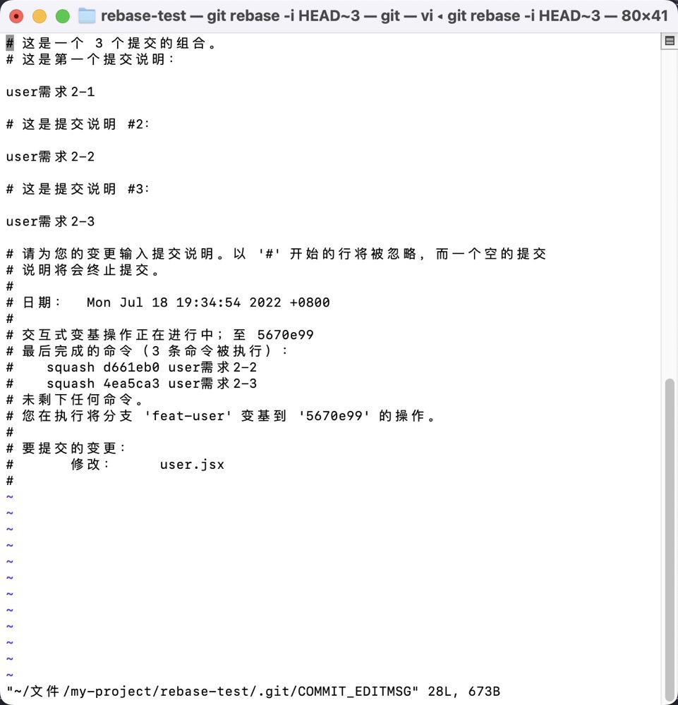

我们修改第一条注释信息按上述步骤操作即可

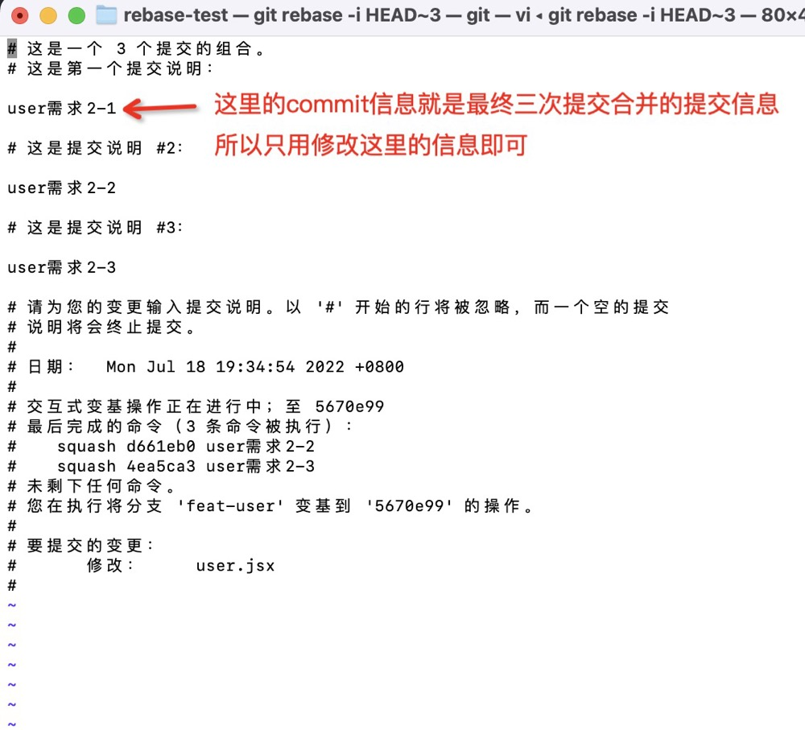

最后保存，提示变基成功

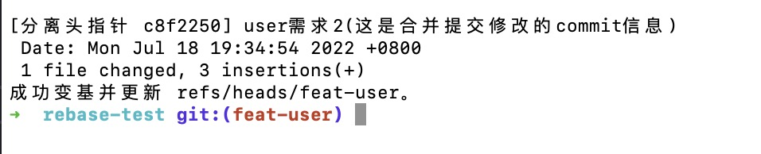

然后回到 source tree 中查看提交记录

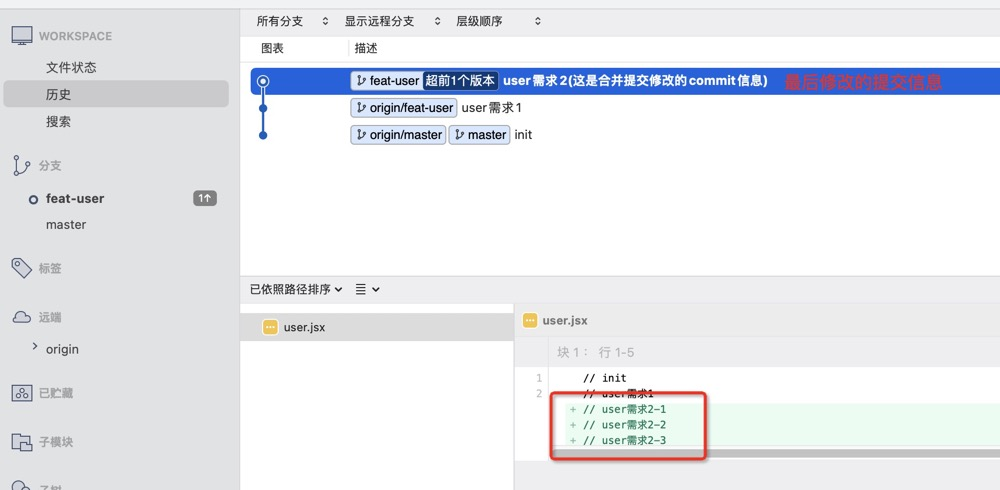


## 参考文章

[使用git rebase合并多次commit](https://github.com/zuopf769/how_to_use_git/blob/master/%E4%BD%BF%E7%94%A8git%20rebase%E5%90%88%E5%B9%B6%E5%A4%9A%E6%AC%A1commit.md)

[git实用技巧：将多次commit合并为一次](https://blog.csdn.net/vxzhg/article/details/105448190)


<SideTitle :page="$page" />
