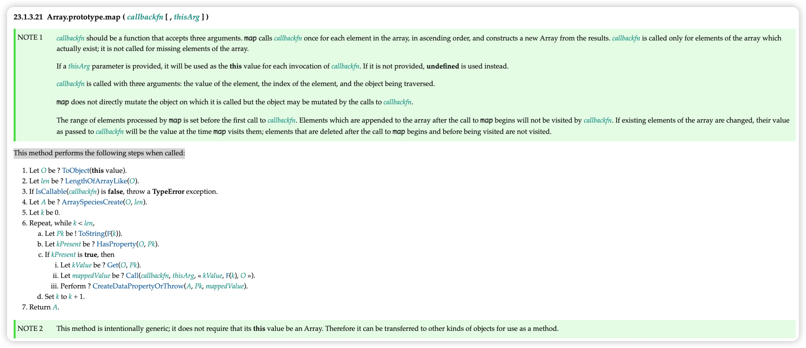

# 手写-数组map

## 草案分析

依照 [ecma262 草案](https://tc39.es/ecma262/#sec-array.prototype.map)，实现的map的规范如下:



## 代码实现

```js
Array.prototype.map = function (callbackFn, thisArg = {}) {
  // 处理数组类型异常
  if (this === null || this === undefined) {
    throw new TypeError("Cannot read property 'map' of null or undefined")
  }
  // 处理回调类型异常
  if (Object.prototype.toString.call(callbackFn) != '[object Function]') {
    throw new TypeError(callbackFn + ' is not a function')
  }
  // 防止 Array.protptype.map.call('String', fn) 这样调用 并且配合下面 O.length >>> 0
  let O = Object(this)
  let T = thisArg

  // >>> 保证为数字并且取整
  let len = O.length >>> 0
  let A = new Array(len)
  for (let k = 0; k < len; k++) {
    if (k in O) {
      let kValue = O[k]
      let mappedValue = callbackFn.call(T, kValue, k, O)
      A[k] = mappedValue
    }
  }
  return A
}
```

## 细节注意

### 类型判断

数组类型异常判断，防止通过 Array.prototype.map.call(null, fn) 形式调用

### 长度取整

`>>>` 无符号右移 数字取整

### 属性判断

- 遍历时判断用 `in` 而不是 `hasOwnProperty`, `in` 可以查找到原型链上的属性，而 `hasOwnProperty` 只能查找私有属性

```js
function MyArray () {}

MyArray.prototype = new Array(1,2,3)

const myArray = new MyArray()

const newMyArray = myArray.map(e => e *2)

console.log('newMyArray', newMyArray); // [2, 4, 6]

//如果用 hasOwnProperty 判断，结果则是 [empty × 3]
```

- 也可以提高对 `[1, , , , , , 2, , , , , 3, , , , , 4]` 稀疏数组处理的性能

## 参考文章

[(建议精读)原生JS灵魂之问(中)，检验自己是否真的熟悉JavaScript？](https://juejin.cn/post/6844903986479251464#heading-25)


