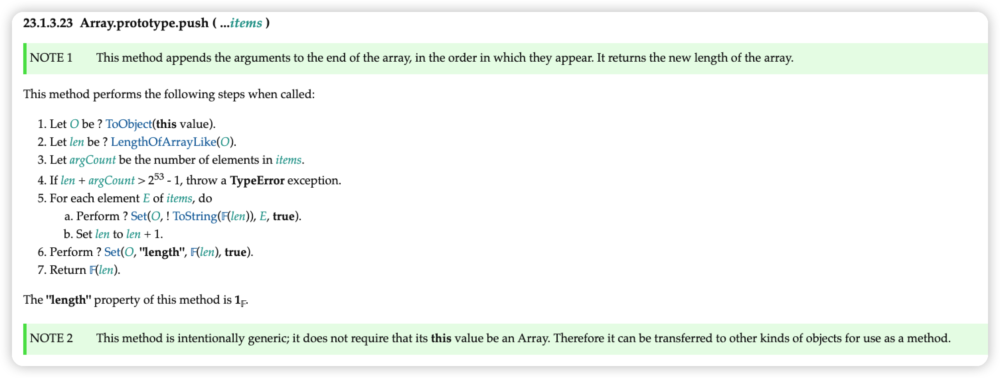

# 手写-数组push

## 草案分析

依照 [ecma262 草案](https://tc39.es/ecma262/#sec-array.prototype.push)，实现的push的规范如下:



## 代码实现

```js
Array.prototype.push = function(...items) {
  let O = Object(this);
  let len = this.length >>> 0;
  let argCount = items.length >>> 0;
  // 2 ** 53 - 1 为JS能表示的最大正整数
  if (len + argCount > 2 ** 53 - 1) {
    throw new TypeError("The number of array is over the max value restricted!")
  }
  for(let i = 0; i < argCount; i++) {
    O[len + i] = items[i];
  }
  let newLength = len + argCount;
  O.length = newLength;
  return newLength;
}
```

## 参考文章

[(建议精读)原生JS灵魂之问(中)，检验自己是否真的熟悉JavaScript？](https://juejin.cn/post/6844903986479251464#heading-25)


<SideTitle :page="$page" />