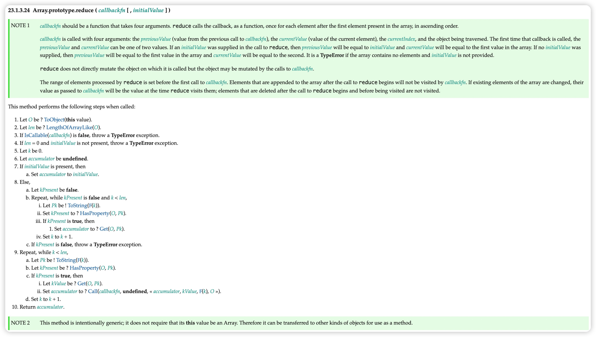

# 手写-数组reduce

## 草案分析

依照 [ecma262 草案](https://tc39.es/ecma262/#sec-array.prototype.reduce)，实现的reduce的规范如下:



根据草案可以得出两个核心要点

- 初始值不穿值怎么处理
- 回调函数的参数有哪些，返回值如何处理

## 代码实现

```js
Array.prototype.reduce  = function(callbackfn, initialValue) {
  // 异常处理，和 map 一样
  // 处理数组类型异常
  if (this === null || this === undefined) {
    throw new TypeError("Cannot read property 'reduce' of null or undefined");
  }
  // 处理回调类型异常
  if (Object.prototype.toString.call(callbackfn) != "[object Function]") {
    throw new TypeError(callbackfn + ' is not a function')
  }
  let O = Object(this);
  let len = O.length >>> 0;
  let k = 0;
  let accumulator = initialValue;
  if (accumulator === undefined) {
    for(; k < len ; k++) {
      // 查找原型链
      if (k in O) {
        accumulator = O[k];
        k++;
        break;
      }
    }
  }
  // 表示数组全为空
  if(k === len && accumulator === undefined) 
    throw new Error('Each element of the array is empty');
  for(;k < len; k++) {
    if (k in O) {
      // 注意，核心！
      accumulator = callbackfn.call(undefined, accumulator, O[k], k, O);
    }
  }
  return accumulator;
}
```

## 参考文章

[(建议精读)原生JS灵魂之问(中)，检验自己是否真的熟悉JavaScript？](https://juejin.cn/post/6844903986479251464#heading-25)


<SideTitle :page="$page" />