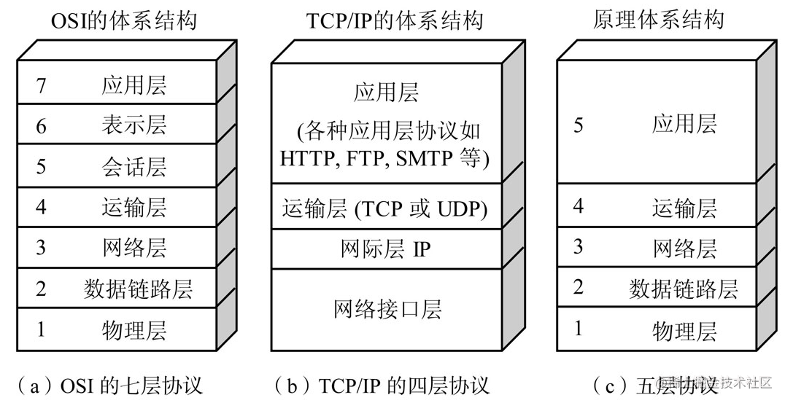

# 计算机网络基础概念

## 计算机网络五层架构(原理体系)

一般说计算机网络架构默认指原理体系的五层架构

- 应用层
  - 网络应用
  - 为人类用户或者其他应用进程`提供网络应用服务`
  - FTP、SMTP、HTTP、DNS
- 传输层（运输层）
  - 主机之间的数据传输
  - 在网络层提供的端到端通信的基础上，细分为`进程到进程，将不可靠的通信变成可靠通信`
  - TCP、UDP
- 网络层
  - 为数据报从源到目的选择路由
  - `主机与主机之间的通信，端到端通信，不可靠`
  - IP、路由协议
- 链路层（数据链路层）
  - 相邻网络节点间的数据传输
  - `两个相邻两点的通信，点到点通信，可靠或不可靠`
  - 点对点协议PPP、802.11（wifi）、Ethernet
- 物理层
  - 在线路上传送bit

## 每层工作的原理以及实例

原理：
- 主要功能
  - 具备的能力 每一层的功能都通过向上层提供的接口 向上层提供服务 功能包含的范围更大 每一层的功能又需要下层提供的服务来实现

- 提供服务
  - 服务是功能的一个体现

实例：  
每一层比较著名或者流行的协议

## 什么是Internet（互联网）

从构成角度上讲

- 节点
  - `主机节点` 主机及其上运行的应用程序
  - `数据交换节点` 路由器、交换机等网络交换设备
- 边(链路)
  - `接入链路（Access）` 主机连接到互联网的链路
  - `骨干链路（Backbone）` 路由器间的链路
- 协议
  - 对等层实体在通讯过程中应该遵守的`规则的集合`（语法、语义、时序、动作）

从服务角度看

- 分布式应用进程 和 为分布式应用提供通信的基础设施（以api形式）
- 基础设施提供的服务分为两种（面向连接TCP 无连接UDP）

## 网络结构

### 网络边缘

- 端系统（主机）
  - 运行应用程序
  - 如Web、email
  - 在 `网络的边缘`
- 客户/服务器模式（C/S架构）
  - 客户端向服务器请求、连接服务
  - 如Web浏览器/服务器，email客户端/服务器
- 对等（peer-peer）模式
  - 很少（甚至没有）专门的服务器
  - 如迅雷、KaZaA等

网络边缘的连接分为两种 `TCP和UDP` 

#### 网络边缘：采用网络设施的面向连接服务（TCP）

目标：在端系统之间传输数据  
- 握手：在数据传输之前做好准备
- TCP（传输控制协议-Transmission Control Protocol）

TCP服务特点：
- 可靠性
- 流量控制
- 拥塞控制

使用TCP的应用：
- HTTP（Web）
- FTP（文件传送）
- Telnet（远程登录）
- SMTP（email）

#### 网络边缘：采用基础设施的无连接服务（UDP）

目标：在端系统之间传输数据
- 无连接服务

UDP特点：
- 无连接
- 不可靠性
- 无流量控制
- 无拥塞控制

使用TCP的应用：
- 流媒体
- 远程会议
- DNS
- Internet电话

### 网络核心

### 接入网、物理媒体
_____________________________

网络结构

网络边缘

网络核心

## 参考文章

[中科大郑烇、杨坚全套《计算机网络（自顶向下方法 第7版，James F.Kurose，Keith W.Ross）》课程](https://www.bilibili.com/video/BV1JV411t7ow/?spm_id_from=333.337.search-card.all.click)

[【网络】七层？五层？四层？ 计算机网络参考模型](https://juejin.cn/post/7037011384575475743)

