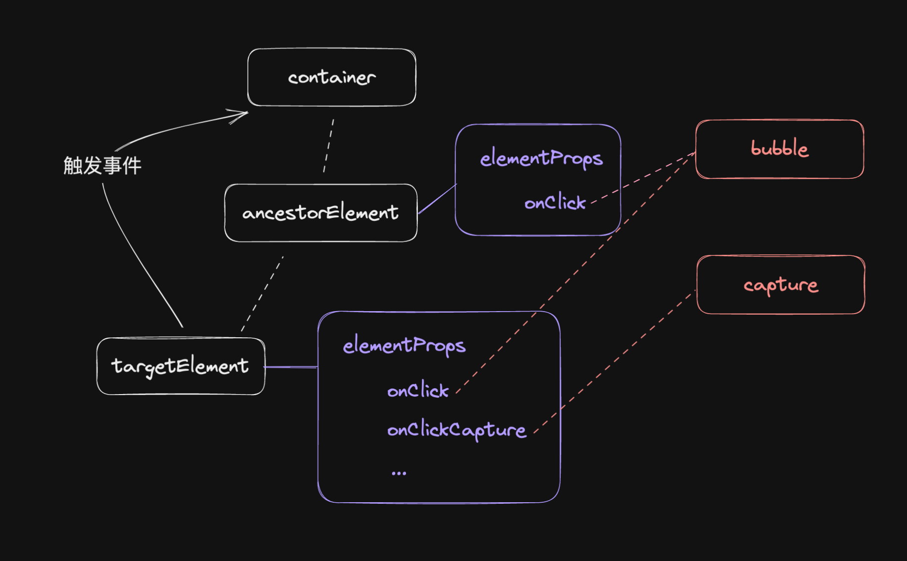
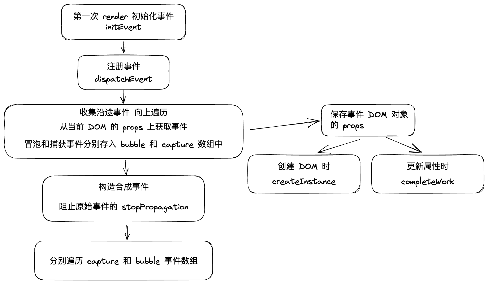

# 实现事件系统

事件系统本质上植根于浏览器事件模型，所以他隶属于 ReactDOM，在实现时要做到对Reconciler 0侵入。

实现事件系统需要考虑：

- 模拟实现浏览器事件捕获、冒泡流程
- 实现合成事件对象
- 方便后续扩展(不同事件，不同优先级)

## 实现 ReactDOM 与 Reconciler 对接

将事件回调保存在 DOM 中，通过以下两个时机对接：

- 创建DOM时
- 更新属性时

## 模拟实现浏览器事件流程

<SideTitle :page="$page" />

