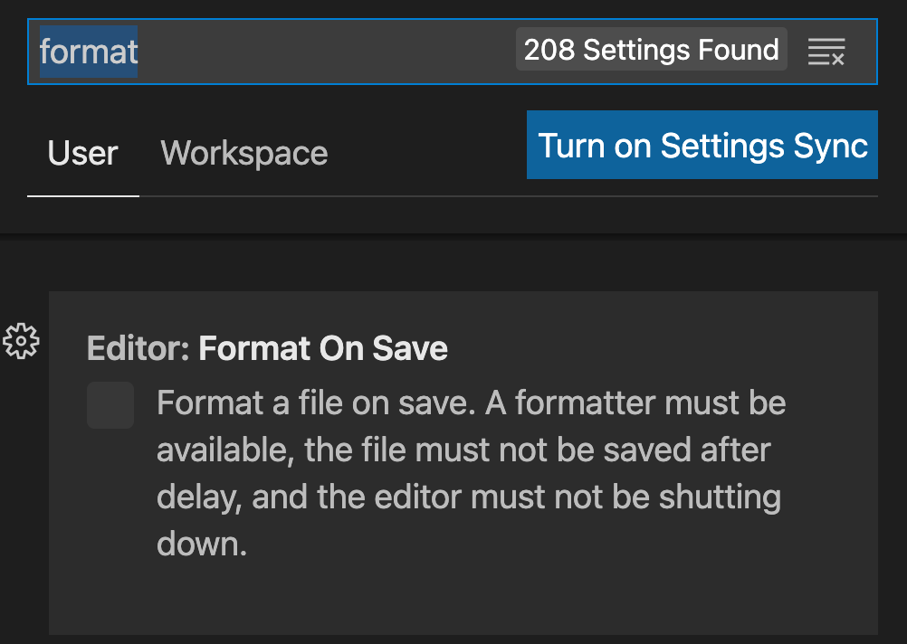

# 初始化项目

## 项目结构

Multi-repo 和 Mono-repo 该如何选择？

<Image src='./images/init-1.png' />

- Multi-repo 每个库有自己独立的仓库，逻辑清晰，相对应的，协同管理会更繁琐。

- Mono-repo 可以很方便的协同管理不同独立的库的生命周期，相对应的，会有更高的操作复杂度。


[参考资料：现代前端工程为什么越来越离不开 Monorepo?](https://juejin.cn/post/6944877410827370504)

## Mono-repo 技术选型

1. 简单工具 

- npm workspace
- yarn workspace
- pnpm workspace

2. 专业工具

- nx
- bit
- turborepo
- rush.js
- lerna

选用 pnpm 相比其他打包工具的优势：

- 依赖安装快
- 更规范（处理幽灵依赖问题）

[参考资料：pnpm 是凭什么对 npm 和 yarn 降维打击的？](https://juejin.cn/post/7127295203177676837)

## pnpm 初始化

```js
npm install -g pnpm
pnpm init
```

根目录下创建 pnpm-workspace.yaml 文件

[初始化pnpm-workspace.yaml](https://pnpm.io/zh/pnpm-workspace_yaml)

## 定义开发规范

### 代码规范检查与修复

代码规范：eslint

安装

```js
// Mono-repo 的项目代码工具需要安装在根目录下 -w 就是意思就是安转载根目录下
pnpm i eslint -D -w
```

初始化

```js
npx eslint --init
```

新建 `.eslintrc.json` 配置如下：

```json
{
   "env": {
    "browser": true,
    "es2021": true,
    "node": true
   },
   "extends": [
    "eslint:recommended",
    "plugin:@typescript-eslint/recommended",
    "prettier",
    "plugin:prettier/recommended"
   ],
   "parser": "@typescript-eslint/parser",
   "parserOptions": {
    "ecmaVersion": "latest",
    "sourceType": "module"
   },
   "plugins": ["@typescript-eslint", "prettier"],
   "rules": {
    "prettier/prettier": "error",
    "no-case-declarations": "off",
    "no-constant-condition": "off",
    "@typescript-eslint/ban-ts-comment": "off"
   }
}
```

安装ts的eslint插件：

```shell
pnpm i -D -w @typescript-eslint/eslint-plugin 
```

代码风格：prettier

安装：

```shell
pnpm i prettier -D -w
```

新建 `.prettierrc.json` 配置文件，添加配置：

```json
{
 "printWidth": 80,
 "tabWidth": 2,
 "useTabs": true,
 "singleQuote": true,
 "semi": true,
 "trailingComma": "none",
 "bracketSpacing": true
}
```

prettier 可能会与 eslint 规则冲突，所以需要将 prettier 集成到 eslint 中，其中：

- eslint-config-prettier：覆盖ESLint本身的规则配置

- eslint-plugin-prettier：用Prettier来接管修复代码即eslint --fix

```shell
pnpm i eslint-config-prettier eslint-plugin-prettier -D -w
```

为lint增加对应的执行脚本，并验证效果：

```shell
"lint": "eslint --ext .js .ts,.jsx,.tsx --fix --quiet ./packages"
```

验证成功后，安装 `prettier` 与 `eslint` 的 VSCode 插件，并在 setting 中设置为保存后自动执行。



### commit 规范检查

安装 husky，用于拦截 commit 命令：

```shell
pnpm i husky -D -w
```

初始化husky：

```shell
npx husky install
```

将刚才实现的格式化命令 pnpm lint 纳入 commit 时 husky 将执行的脚本：

```shell
npx husky add .husky/pre-commit "pnpm lint"
```

::: tip 注
pnpm lint会对代码全量检查，当项目复杂后执行速度可能比较慢，届时可以考虑使用  [lint-staged](https://github.com/okonet/lint-staged)，实现只对暂存区代码进行检查
:::

通过 commitlint对 git 提交信息进行检查，首先安装必要的库：

```shell
pnpm i commitlint @commitlint/cli @commitlint/config-conventional -D -w
```

新建配置文件 `.commitlintrc.js` ：

```js
module.exports = {
  extends: ["@commitlint/config-conventional"]
}; 
```

集成到 husky 中：

```shell
npx husky add .husky/commit-msg "npx --no-install commitlint -e $HUSKY_GIT_PARAMS"
```

conventional 规范集意义：

```js
// 提交的类型: 摘要信息
<type>: <subject>
```

常用的 type 值包括如下:

- feat: 添加新功能
- fix: 修复 Bug
- chore: 一些不影响功能的更改
- docs: 专指文档的修改
- perf: 性能方面的优化
- refactor: 代码重构
- test: 添加一些测试代码等等

配置 `tsconfig.json` ：

```json
{
 "compileOnSave": true,
 "compilerOptions": {
  "target": "ESNext",
  "useDefineForClassFields": true,
  "module": "ESNext",
  "lib": ["ESNext", "DOM"],
  "moduleResolution": "Node",
  "strict": true,
  "sourceMap": true,
  "resolveJsonModule": true,
  "isolatedModules": true,
  "esModuleInterop": true,
  "noEmit": true,
  "noUnusedLocals": true,
  "noUnusedParameters": true,
  "noImplicitReturns": false,
  "skipLibCheck": true,
  "baseUrl": "./packages"
 }
}
```

### 选择打包工具

比较不同打包工具的区别 [参考资料：Overview | Tooling.Report](https://bundlers.tooling.report/)

我们要开发的项目的特点：

- 是库，而不是业务项目
- 希望工具尽可能简洁、打包产物可读性高
- 原生支持ESM

所以选择rollup，安装：

```shell
pnpm i -D -w rollup
```

根目录新建 script 文件用于存放项目所有脚本文件，在新建 rollup 文件存放对应 rollup 代码

<SideTitle :page="$page" />
