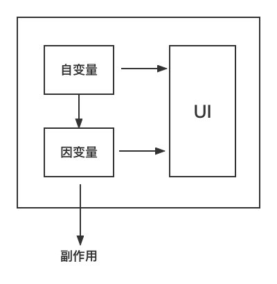

# 初识前端框架

## 框架原理概括

1.React 是库 (library) 还是框架 (framework) ?

2.Vue 号称是 `构建用户界面的渐进式框架`，怎么理解渐进式？

不管是 React 还是 Vue，他们的核心都是 `构建UI的库`，由以下两部门组成

1. 基于状态的声明式渲染
2. 组件化的层次结构

随着应用复杂程度的提升，需要对不同的需求进行扩展，也有了不同的解决方案，如

- 状态管理的难度升级 => Redux Pinia Vuex
- 简单页面升级为SPA（Single Page Application）=> React-Router Vue-Router
- 提高首屏渲染速度、满足 SEO => SSR（Server Side Render）

除上面提到的功能外，还有许多功能是 React 与 Vue 本身不包括的，比如构建支持、数据流方案、文档工具等。

**所以，React 与 Vue 本身仅仅是库，而不是框架**

我们可以称 "包含库本身以及附加功能" 的解决方案称为框架，例如

- UmiJS 是一款基于 React，内置路由、构建、部署等功能的前端框架
- Next.js 是一款基于 React,支持 SSR、SSG（Static Site Generation，静态页面构建）的服务端框架
- AngularJS 是一款内置多种功能的前端框架

总结：

1. React 与 Vue 本身仅仅是库，而不是框架
2. Vue 的 “渐进式” 是指 “可以按照需求渐进地引入附加功能”，而不是像 AngularJS 一样开箱即用

## 初识前端框架

几乎所有现代前端框架的实现原理都可以用一下公式替代

> UI = *f*(state)

- state 代表 `当前视图状态`
- *f* 代表 `框架内部运行机制`
- UI 代表 `宿主环境的视图`

### 描述UI

#### JSX

React 团队认为 “UI本质上与逻辑存在耦合的部分” 例如

- 在 UI 上绑定事件
- 在状态变化后改变 UI 的样式或结构

由于前端工程师使用 ES 编写逻辑，因此同样可以使用 ES 描述 UI，即可使用 UI 与逻辑配合更密切。至于最终方案设计为 `类XML` 的 ES 语法糖，则是因为前端工程师更熟悉 HTML。

::: tip 注
高灵活性意味着 JSX 需要牺牲 ”潜在的编译时优化空间“，后续会解释
:::

#### 模版语言

在原有 HTML 语法的基础上添加了自定义语法。 比如 Vue 的 v-if、v-show、v-for，{{}}等。

本质是通过扩展 HTML 元素属性实现各种逻辑，这么做的好处是合法的 HTML 语法，可以直接在浏览器中正常直接显示 ”未替换的原始模版页面“。

#### 总结

1. JSX 的出发点使用 ES 描述逻辑，就扩展 ES 语法，使它能够描述 UI，即 ”从逻辑出发扩展逻辑，描述 UI“
2. 模版语法 的出发点使用 HTML 描述 UI，那就扩展 HTML,使它能够描述逻辑，即 ”从 UI 出发,扩展 UI，描述逻辑“

### 如何组织 UI 与逻辑

为了实现 UI 与逻辑的关注点分离，需要一种存放 UI 与逻辑的松散耦合单元，这就是组件

关于组件有两个很重要的问题需要解释

1. 组件如何组织逻辑与 UI
2. 如何在组件之间传输数据

这里借助初中数学知识 "自变量与因变量",如

`2x + 1 = y`

x 的变化会导致 y 的变化，其中 x 被称为自变量，y 被称为因变量

定义自变量可以用 useState hooks => const [number, setNumber] = useState(0)

而在前端框架中，因变量又有两种类型：

1. 无副作用因变量 => useMemo(() => 2x, [x]) (对应处理逻辑)
2. 有副作用因变量 => useEffect(() => { document.title = x.value }, [x] ) (对应处理逻辑)

那么我们可以得出组件内部工作流程如下图：



综上所述，组件通过三种方式组织逻辑与UI

1. 逻辑中的自变量变化，导致 UI 变化
2. 逻辑中的自变量变化，导致 ”无副作用因变量“ 变化，导致 UI 变化
3. 逻辑中的自变量变化，导致 ”有副作用的因变量“ 变化， 导致 UI 变化

### 如何在组件之间传输数据

1. React.createContext => context / context.provider useContext
2. props
3. store（Redux、Mobx、Pinia）

### 前端框架的分类依据

由上述的出的公式 `UI = *f*(state)` 可以知道，state（自变量）,是通过直接或者间接（因变量）的方式改变 UI，而这里的 UI 仅仅是 ”对实际宿主环境 UI 的描述“，并不是实际宿主环境 UI。

比如

```jsx
const header = <h1>Hello World</h1>
```

上述代码只是对 ”对宿主环境 UI 的描述“，通过框架处理后，在宿主环境（比如浏览器）中显示的 H1 样式的 Hello World 才是 ”真实的 UI“

所以公式可以拆解为一下两步：

1. 根据自变量（state）变化计算出 UI 变化
2. 根据 UI 变化执行具体的宿主环境 API （比如浏览器 DOM API）

对于步骤 2，不同的前端框架的实现基本一致，差异性主要体现在步骤 1上，所以前端框架主要需要关注 "自变量与 x 的对应关系"。

随着 x 抽象层级不同不断下降，”自变量到 UI 变化“ 的路径越多，就意味着前端框架在运行时消耗在寻找 ”自变量与 UI 的对应关系“ 上的时间越少

根据 ”与自变量建立对应关系的抽象层级“ 作为其分类依据，前端框架可以分为以下三类

1. 应用级框架 => React
2. 组件级框架 => Vue
3. 元素级框架 => Solid

### React 中的自变量与因变量

- useState
- useReducer
- useContext 

- useMemo => 采用缓存的方式 => 无副作用因变量
- useCallback => 采用缓存的方式 => 无副作用因变量 => 缓存值为函数形式

- useEffect => 有副作用因变量

- useRef => 让 UI 与逻辑之间更灵活

## 前端框架使用的技术

### 细粒度更新

在 Vue 和 Mobx 中使用的 ”能自动追踪依赖的技术“ 被称为 ”细粒度更新“（Finegrained Reactivity），这不是一项新技术，KnockoutJS 曾今在 2010 年采用这种技术实现 ”响应式更新“

这种 ”响应式更新“ 相比 React Hooks 有两个显著优点

1. 无需显示指明依赖
2. 由于可以自动跟踪依赖，因此不受 React Hooks ”不能再条件语句中声明 Hooks“ 的限制

那么为什么 React Hooks 没有使用细粒度更新呢？

原因是 React 属于应用级框架，从关注 ”自变量与应用的对应关系“ 角度看，其更新粒度不需要很细，因此无需使用细粒度更新。作为代价，React Hooks 在使用上则会受到以上两个优点相对应的限制

### AOT

现代框架都需要 ”编译“ 这一步骤，用于： 

- 将 ”框架中描述的 UI“ 转换为宿主环境可识别的代码
- 代码转化，比如将 ts 编译为 js、实现 polyfill等
- 执行一些编译时优化
- 代码打包、压缩、混淆

”编译“ 可选择两个时机执行
- 代码在构建时，被称为 AOT（Ahead Of Time 提前编译或预编译），宿主环境获得的是编译后的代码
- 代码在宿主环境执行时，被称为 JIT （Just In Time 即时编译），代码在宿主环境中编译并执行

AOT 与 JIT 的区别包括
- AOT 编译报错，JIT 宿主环境运行报错
- 使用 JIT 的应用 `首次加载慢于` AOT 的应用，因为其需要先编译代码，AOT的应用已经在构建时完成编译，可以直接执行代码
- 使用 JIT 的应用 `代码体积可能大于` 使用 AOT 的应用，因为运行时会增加编译器代码

借助 AOT 对模版语法编译时的优化，可以减少之前提到公式工作原理的第一步 `根据自变量变化计算出 UI 变化`。这是大部分 ”采用模版语法描述 UI “的前端框架都会进行的优化，如Vue3、Angular、Svelte，因为模版语法是固定的，固定意味着 `可分析`，`可分析` 意味着在编译时可以标记模版语法静态部分与动态部分，使步骤1在寻找 “变化的 UI” 时可以跳过静态部分。

::: tip 注
AOT 能够在多大程度上减少步骤1（根据自变量变化计算出 UI 变化）视框架实现细节不同而不同
:::

可是 “采用 JSX 描述 UI” 的前端框架则难以 AOT 中收益，原因在于 JSX 是 ES 的语法糖，ES 语句的灵活性使其很难进行静态分析

不过有两个思路可以使 “使用 JSX 描述 UI” 的前端框架在 AOT 中收益

1. 使用新的 AOT 实现
2. 约束 JSX 的灵活性

不过 Meta 正在开发的 React Forget 编译器试图来解决这方面问题

### Virtual DOM

Virtual DOM 是实现 “根据自变量变化计算出 UI 变化” 的一种主流技术，其工作原理可以概括为两个步骤：
1. 将 ”元素描述的 UI“ 转化为 ”VDOM 描述的 UI“
2. 对比变化前后 ”VDOM 描述的 UI“，计算出 UI 中发生变化的部分

VDOM 细节上 Vue 和 React 又有一些区别   

Vue：使用 `模版语法` 描述 UI，模版语法变异为 render 函数  
1.render 函数执行后返回 ”VNode 描述的 UI“ => render   
2.将变化前后 ”VNode 描述的 UI“ 进行比较，计算出 UI 中变化的部分 => patch

React：使用 JSX 描述 UI，JSX 编译为 createElement 方法
1. createElement 方法执行后返回 ”React Element 描述的 UI“
2. 将 ”React Element 描述的 UI“ 与变化前 ”FiberNode 描述的 UI“ 进行比较，计算出 UI 中变化的部分，同时生成本次更新 ”FiberNode 描述的 UI“

VDOM 的主要优点：
1. 相较于 DOM 的体积优势 (DOM 包含大量冗余的属性)
2. 相较于 AOT 更强大的描述能力
3. 多平台渲染的抽象能力

<SideTitle :page="$page" />