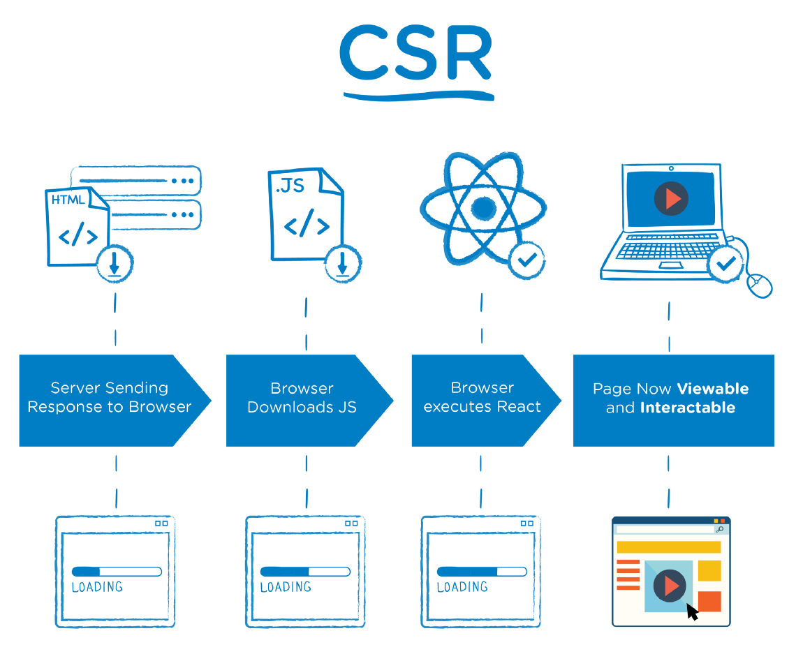
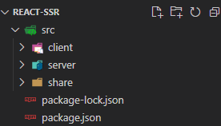
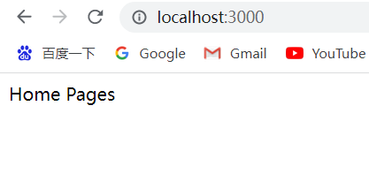

# React-SSR

## 什么是客户端渲染

CSR：Client Side Rendering  
服务器端仅返回 JSON 数据，DATA 和 HTML 在客户端进行渲染

### 存在的问题

- 首屏等待时间长, 用户体验差
- 页面结构为空, 不利于 SEO

SPA 应用中服务器端渲染解决的问题  


## 什么是服务器端渲染

SSR：Server Side Rendering  
服务器端返回 HTML，DATA 和 HTML 在服务器端进行渲染

SPA 应用中服务器端渲染解决的问题  


## React SSR 同构

同构指的是代码复用，即实现客户端和服务端最大程度的代码复用

### 快速搭建ssr项目

先创建一个新项目，目录结构如下

  
package.json 代码如下

```json
{
  "version": "1.0.0",
  "description": "",
  "main": "index.js",
  "keywords": [],
  "author": "",
  "license": "ISC",
  "dependencies": {
    "@babel/cli": "^7.10.3",
    "@babel/core": "^7.10.3",
    "@babel/polyfill": "^7.10.4",
    "@babel/preset-env": "^7.10.3",
    "@babel/preset-react": "^7.10.1",
    "axios": "^0.19.2",
    "babel-loader": "^8.1.0",
    "express": "^4.17.1",
    "nodemon": "^2.0.4",
    "npm-run-all": "^4.1.5",
    "react": "^16.13.1",
    "react-dom": "^16.13.1",
    "react-helmet": "^6.1.0",
    "react-redux": "^7.2.0",
    "react-router-config": "^5.1.1",
    "react-router-dom": "^5.2.0",
    "redux": "^4.0.5",
    "redux-thunk": "^2.3.0",
    "serialize-javascript": "^4.0.0",
    "webpack": "^4.43.0",
    "webpack-cli": "^3.3.12",
    "webpack-dev-server": "^3.11.0",
    "webpack-merge": "^4.2.2",
    "webpack-node-externals": "^1.7.2"
  }
}
```

### 创建 Node 服务器

`./server/http.js`

```js
import express from "express";

const app = express();

app.use(express.static('public'));

app.listen(3000, () => console.log("server is listening on 3000 port"));

export default app;
```

`./server/index.js`

```js
import app from "./http";

app.get('/', (req, res) => {
  
})
```

### 实现React SSR

1. 引入要渲染的 React 组件
2. 通过 renderToString 方法将 React 组件转换为 HTML 字符串
3. 将结果HTML字符串想到到客户端

> renderToString 方法用于将 React 组件转换为 HTML 字符串, 通过 react-dom/server 导入 

对于 React 组件来说，是客户端和服务端通用的，所以可以放在share目录下

`./share/pages/Home.jsx`

```js
import React from "react";

function Home() {
  return (
    <div>Home Pages</div>
  );
}

export default Home;
```

配置路由，返回 Home 组件

`./server/inde.js`

```js
import app from "./http";
import React from "react"; // 因为下面 <Home /> 为jsx语法 需要导入 React
import Home from '../share/pages/Home'
import { renderToString } from 'react-dom/server'

app.get('/', (req, res) => {
  const content = renderToString(<Home />)
  res.send(`
    <html>
      <head>
        <title>React SSR</title>
      </head>
      <body>
        <div id="root">${content}</div>
      </body>
    </html>
  `)
})
```

### webpack 打包配置

完成到上步截止，代码似乎看上去没什么问题，但是是运行不起来的，原因是：

- Node 环境不支持 ESModule
- Node 环境不支持 JSX 语法

所以需要借助 webpack 调用 babel 对文件进行打包，然后运行打包之后的文件

`./webpack.server.js`

```js
const path = require('path')

module.exports = {
  mode: 'development',
  target: 'node',
  entry: './src/server/index.js',
  output: {
    path: path.join(__dirname, 'build'),
    filename: 'bundle.js'
  },
  module: {
    rules: [{
      test: /\.js$/,
      exclude: /node_modules/,
      use: {
        loader: 'babel-loader',
        options: {
          // @babel/preset-env 转换高级的 js 语法
          // @babel/preset-react 转换 jsx 语法
          presets: ["@babel/preset-env", "@babel/preset-react"]
        }
      }
    }]
  }
}
```

然后配置 script 脚本

`./package.json`

```json
"scripts": {
  "dev:server-build": "webpack --config webpack.server.js"
},
```

然后在终端执行执行 `npm run dev:server-build` 命令

打包之后会在根目录生成 build 文件，里面会有 bundle.js，然后用 node直接运行

 

现在可以看到服务启动后访问网址返回刚刚的 Home 组件所写内容

### 项目启动命令配置优化

每次修改上述代码后都要重新打包运行比较繁琐，所以监控文件变化，自动打包就尤为重要

```json
"scripts": {
  "dev:server-run": "nodemon --watch build --exec \"node build/bundle.js\"",
  "dev:server-build": "webpack --config webpack.server.js --watch"
},
```

<SideTitle :page="$page" />